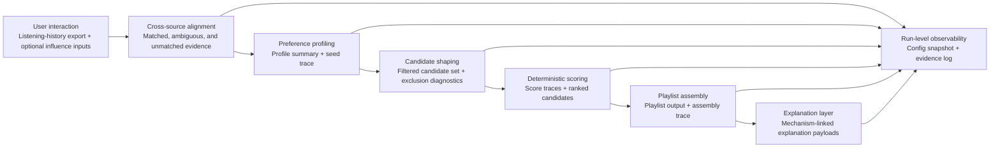
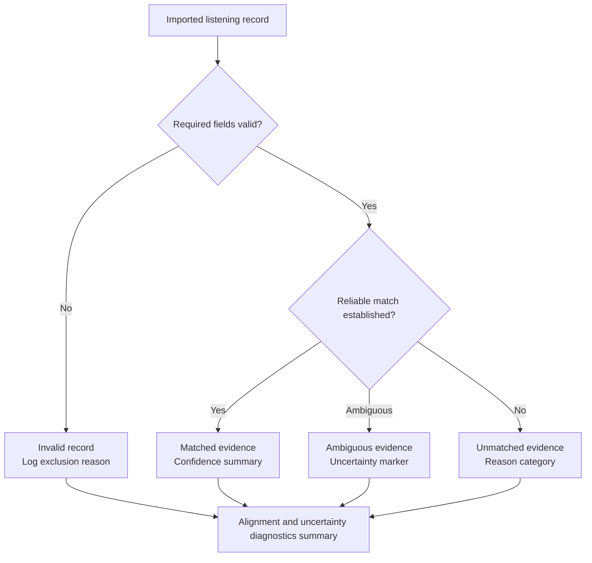
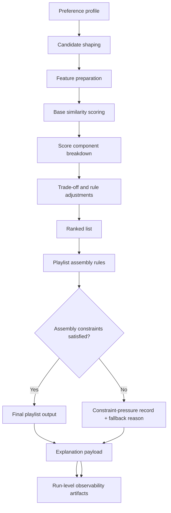

# Chapter 3: Design and Methodology

## 3.1 Introduction
This chapter presents the design methodology and system architecture for the playlist-generation pipeline. It translates the requirements identified in Chapter 2 into concrete design decisions covering alignment, profiling, candidate shaping, scoring, assembly, and observability. The chapter proceeds from methodological position and literature-derived requirements to the overall architecture, then to the main design areas of alignment, profile construction, candidate shaping, scoring, playlist assembly, and run-level evidence.

## 3.2 Design Methodology
This chapter takes a Design Science Research position in which the Chapter 2 literature synthesis is converted into explicit engineering requirements and then into an implementable artefact architecture (Peffers et al., 2007). The workflow follows the thesis sequence established in Chapter 1: literature -> requirements -> design -> implementation -> evaluation. Chapter 3 therefore defines the intended design of the artefact, while later chapters assess how well that design is realized.

This distinction matters because the chapter is not trying to establish a universally best recommendation method. It defines an architecture that is defensible within the contribution boundary established at the end of Chapter 2: a transparent and controllable playlist-generation pipeline under cross-source data conditions, evaluated through explicit engineering evidence rather than model-family novelty.

## 3.3 Literature-Driven Design Requirements
Chapter 2 points to six design requirements that should shape the artefact.

| Requirement | Design rationale |
| --- | --- |
| Uncertainty-aware preference evidence | Interaction history should be treated as useful but imperfect evidence rather than direct preference truth (Adomavicius and Tuzhilin, 2005; Roy and Dutta, 2022). |
| Inspectability | Rankings should be traceable to explicit scoring, candidate-selection, and assembly decisions rather than persuasive post-hoc language alone (Tintarev and Masthoff, 2007, 2012; Zhang and Chen, 2020). |
| Practical controllability | The system should expose clear user influence paths and decision-relevant controls whose effects can later be examined (Andjelkovic et al., 2019; Jin et al., 2020). |
| Candidate-generation visibility | Profile construction and candidate shaping should be treated as substantive modelling stages, not hidden preprocessing (Zamani et al., 2019; Ferraro et al., 2018). |
| Playlist-aware trade-offs | The design should make coherence, diversity, novelty, and ordering explicit rather than treating playlist quality as a single objective (Bonnin and Jannach, 2015; Vall et al., 2019; Schweiger et al., 2025). |
| Run-level auditability | Observability, reproducibility, and configuration traceability should be part of the design rather than added after the fact (Beel et al., 2016; Bellogin and Said, 2021; Cavenaghi et al., 2023). |

Taken together, these requirements point toward a pipeline with explicit stages and explicit evidence surfaces.

The six thesis objectives guide the main design decisions summarized below, linking the chapter structure to the stated research goals while keeping the design narrative readable.

| Chapter 1 objective | Chapter 3 design response |
| --- | --- |
| O1. Design preference profiling from cross-source listening history | Sections 3.6 and 3.7 define uncertainty-aware alignment and interpretable profile construction from aligned evidence and influence inputs. |
| O2. Implement cross-source alignment and candidate filtering with uncertainty handling | Sections 3.6 and 3.8 specify confidence-aware matching, unmatched/ambiguous handling, and explicit candidate-shaping controls. |
| O3. Implement deterministic scoring and playlist assembly controls | Sections 3.9, 3.10, and 3.12 define deterministic scoring, assembly trade-offs, and controlled-variation protocol. |
| O4. Produce explanation and logging outputs | Section 3.11 defines mechanism-linked explanations plus run-level observability artifacts. |
| O5. Evaluate reproducibility and quality shifts under settings changes | Section 3.12 defines baseline replay and one-parameter-at-a-time controlled variation for interpretable effect testing. |
| O6. Identify limits and applicability boundaries | Sections 3.4 and 3.13 maintain explicit single-user, deterministic, bounded-scope framing for later limitation analysis. |

## 3.4 Design Scope and Overall Architecture
The proposed architecture is a deterministic pipeline with seven main stages:

1. user interaction,
2. cross-source data intake and alignment,
3. preference profiling,
4. candidate shaping,
5. deterministic scoring,
6. playlist assembly,
7. explanation, observability, and control.

Figure 3.1 shows how these stages connect and where the main evidence artifacts are produced.

This layout is chosen to preserve causal traceability from user input to playlist output. Each stage has a clearly defined role and produces intermediate artefacts that can be inspected independently. That separation matters because it allows later evaluation to distinguish profile effects, candidate-space effects, scoring effects, and assembly effects rather than collapsing everything into a single black-box outcome.

Each stage is therefore intended to emit inspectable intermediate outputs rather than only a final playlist. This makes it possible to examine how evidence enters the pipeline, how it is transformed, and where uncertainty, exclusion, or trade-off pressure is introduced.

The architecture also reflects deliberate scope discipline. It is single-user, deterministic, and content-driven, with bounded complexity and explicit contribution limits. These are not treated as missing sophistication. They are methodological choices that keep the artefact auditable and aligned to the research gap identified in Chapter 2.

### 3.4.1 Assumptions and Boundaries
The design rests on a small set of explicit assumptions that bound what later evaluation can claim.

- The user-data basis is a fixed local listening-history export rather than an open-ended live stream of behavior.
- Candidate tracks are drawn from a fixed offline corpus with available metadata and feature descriptors.
- Preference evidence is useful but incomplete, so alignment uncertainty and missingness must remain visible rather than normalized away.
- The artefact is engineered for one-user deterministic inspectability, not for large-scale personalization or online adaptation.
- Control effects are interpreted within this bounded pipeline, so later results should be read as engineering evidence under fixed conditions rather than as universal recommendation performance claims.

Alternative design directions were considered but not adopted as the primary architecture. Latent collaborative and neural approaches were not selected because they weaken direct inspectability of ranking drivers under the thesis scope, even though they may perform strongly in richer multi-user settings (Cano and Morisio, 2017; He et al., 2017; Liu et al., 2025). Probabilistic or heavily stochastic ranking approaches were also not selected because they would make control effects and replay behavior harder to interpret. The design therefore commits to a deterministic, feature-based pipeline because that choice best fits the transparency, controllability, and reproducibility objectives established in Chapters 1 and 2.

## 3.5 Technology Choices and Realisation Context
The design is realized using a lightweight Python-based stack chosen to support traceability and reproducibility rather than platform complexity. Python is used as the core implementation language because it supports clear stage orchestration, structured data handling, and reproducible script execution across the pipeline. Within thesis scope, this is preferable to a more distributed or service-heavy environment because the contribution lies in an auditable recommendation workflow, not in production deployment architecture.

User-side listening evidence enters the active runtime through a static local Spotify export rather than through live API calls at recommendation time. This design choice is deliberate: a pre-exported local input preserves a realistic user-data basis while removing network volatility, endpoint drift, and authentication dependency from the core recommendation run. Optional Spotify export utility runs still use a custom local authorization-code OAuth flow to generate that export in the first place, but that OAuth step remains outside the main deterministic recommendation path.

RapidFuzz is used in alignment logic for bounded metadata fallback matching when strong identifiers are unavailable. This is preferable to exact-only matching because cross-source metadata variation is expected, but it also avoids turning alignment into an opaque learned matching problem. CSV and JSON artifacts are used as the main stage I/O and evidence surfaces instead of a database-centered design because they keep intermediate decisions, diagnostics, and run-level outputs directly inspectable, portable, and easy to compare across runs.

These choices are aligned to the thesis contribution boundary: auditable engineering behavior under cross-source uncertainty.

## 3.6 Cross-Source Preference Evidence and Alignment
The intake boundary is intentionally narrow: one practical listening-history source plus optional user-steerable influence inputs. Imported tracks are transformed into an inspectable preference signal through staged alignment and explicit uncertainty handling.

This design follows the Chapter 2 conclusion that cross-source evidence is structurally uncertain. Alignment is therefore treated as an explicit design stage rather than a hidden preprocessing step. It distinguishes confident matches, ambiguous cases, and unmatched records rather than treating all imported records as equally reliable profile evidence (Elmagarmid et al., 2007; Papadakis et al., 2021).

In practical terms, the alignment stage follows a fixed evidence order. It first checks whether the imported row contains the minimum fields needed for safe processing. If it does, it attempts the strongest available identifier-based match. Only when that path is unavailable or insufficient does it fall back to bounded metadata comparison over title, artist, and related descriptive fields. If one candidate is clearly strongest, the row is treated as a confident match. If several plausible candidates remain close under the fallback logic, the row is retained as ambiguous rather than being forced into certainty. If no acceptable candidate is found, the row is retained as unmatched with an explicit reason category. Imported rows that fail minimum validity checks are surfaced separately as invalid rather than silently discarded. Cross-source music data can contain duplicated entries, naming variation, version suffixes, missing fields, and identifier mismatch. These are treated as manageable but irreducible sources of uncertainty that must be made visible through diagnostics rather than hidden behind aggregate success rates.

Alignment outcomes are therefore represented in three broad categories. Confident matches contribute directly to downstream profile construction. Ambiguous matches remain visible with explicit uncertainty markers so they can be reviewed rather than silently absorbed as certain evidence. Unmatched or invalid records are retained in diagnostics with reason categories so that data-coverage limitations remain observable at the point where evidence enters the system.

In line with Chapter 2, alignment reliability is treated as methodologically grounded but still uncertain because much entity-resolution evidence is cross-domain rather than music-specific. The design consequence is that uncertainty should remain visible at the point where evidence enters the system, not only after final outputs are produced.

Figure 3.2 shows the intended evidence-handling logic.

## 3.7 Preference Profiling
The preference model is built from aligned listening evidence and explicit influence signals using interpretable feature representations. This stage defines what counts as meaningful preference evidence before any candidate is admitted for ranking.

The interpretable feature space in this design is explicitly defined in three groups. Rhythmic and harmonic features include tempo, key, and mode. Affective and intensity-related features include danceability, energy, and valence. Semantic and contextual features include lead genre, genre overlap, and tag overlap (Bogdanov et al., 2013; Deldjoo et al., 2024). These features are selected because they jointly support playlist-level trade-offs: tempo, key, and mode support rhythmic-harmonic compatibility; danceability, energy, and valence provide controllable intensity and affect proxies; and genre- and tag-based features provide interpretable semantic coherence and diversity control.

Feature preparation standardizes values, handles missingness, and prepares weighted attributes for comparable similarity computation. This follows the Chapter 2 argument that profile construction is not neutral preprocessing. It is a normative modelling decision that determines which traces count as preference evidence and how strongly they shape downstream behavior (Bogdanov et al., 2013; Deldjoo et al., 2024; Roy and Dutta, 2022).

The intended flow is straightforward: aligned listening events provide baseline evidence, optional influence-track inputs provide explicit correction or emphasis, and both are combined into weighted feature summaries in the same interpretable feature space as candidate tracks. The resulting profile is therefore designed to make later ranking decisions traceable to explicit feature relationships rather than hidden latent representations. The contribution here is not a novel preference model. It is making profile assumptions visible enough that downstream ranking behavior can be interpreted without guesswork.

## 3.8 Candidate Shaping
Candidate shaping restricts the searchable set before scoring so that the later ranking stage works over an explicit, inspectable candidate space rather than the full corpus. Similarity thresholds, exclusions, and corpus-side filters are therefore treated as modelling decisions rather than mere efficiency settings.

This stage matters because a track can be absent from the final playlist for two fundamentally different reasons: it may never have entered the candidate set, or it may have entered and then been outranked or excluded later. Preserving that distinction improves explanation fidelity and reduces the risk of attributing candidate-space effects to scoring logic. Candidate shaping also gives the design a clear place to represent threshold strictness, influence-track expansion, and corpus-side exclusions as explicit controls whose effects can later be observed in candidate counts, exclusion diagnostics, and downstream score opportunities.

The design intent is therefore to expose candidate shaping as its own evidence surface. It should show how many items were retained, why other items were filtered out, and how strongly the current profile settings determined the reachable search space. This makes candidate-generation visibility concrete rather than rhetorical and keeps Chapter 2's warning about hidden pre-scoring modelling choices directly reflected in the architecture.

## 3.9 Deterministic Scoring
Candidate scoring uses explicit deterministic similarity functions plus documented rule adjustments. This stage is responsible for ranking the already-shaped candidate set, not for silently redefining that set.

The rationale is goal-aligned rather than absolutist: deterministic scoring is selected to maximize inspectability, replayability, and clear control effects under thesis scope, not to claim universal superiority over collaborative, hybrid, or neural alternatives (Cano and Morisio, 2017; He et al., 2017; Liu et al., 2025).

Metric and feature-weight selections are treated as explicit design parameters rather than hidden implementation defaults. This follows Chapter 2's warning that metric choice, normalization, and thresholding can materially reshape recommendation behavior (Fkih, 2022). In methodological terms, this makes scoring behavior testable rather than assumed.

The intended scoring output is therefore not just a ranked list but an inspectable score decomposition showing how feature relationships and rule adjustments contributed to candidate ordering. This keeps the stage interpretable at track level and gives later explanation and evaluation logic a concrete mechanism surface to reference.

## 3.10 Playlist Assembly
Playlist assembly remains a distinct stage rather than a thin post-processing layer. Chapter 2 shows that coherence, diversity, novelty, and ordering can interfere with one another, so collection-level quality is represented as an explicit trade-off rather than a single optimization target.

The assembly stage therefore takes a ranked candidate list as input and applies playlist-level rules that can preserve, relax, or redirect simple score order when collection quality would otherwise degrade. This is where repetition limits, diversity pressure, coherence checks, novelty allowance, and ordering constraints operate as explicit design commitments. Treating assembly separately matters because it creates a clear boundary between track-level merit and list-level construction.

Figure 3.3 shows the intended relationship between scoring and assembly.

## 3.11 Explanation, Observability, and Reproducibility
Explanation outputs are generated directly from scoring contributors, candidate-shaping logic, and assembly-rule effects so that explanation statements remain mechanism-linked. In parallel, observability captures run-level artifacts including the input summary, alignment diagnostics, profile summaries, candidate-filtering outputs, score traces, playlist-rule outcomes, explanation payloads, the run-level observability log, and configuration state.

This coupling supports both user-facing transparency and developer-facing inspectability. It also creates the basis for deterministic replay and control-effect evaluation required by the Chapter 2 accountability gap (Beel et al., 2016; Bellogin and Said, 2021; Sotirou et al., 2025).

At minimum, the run record captures the input basis, configuration state, alignment and uncertainty summaries, profile outputs, candidate-space decisions, score-trace summaries, playlist-rule outcomes, explanation artifacts, and final output identifiers. This does not require production-grade telemetry. It requires a consistent evidence bundle that can be reviewed and compared across runs. Defining this record format in Chapter 3 matters because replay, sensitivity, and explanation-fidelity checks all depend on the same observable execution footprint.

## 3.12 Configuration and Experimental Control
A persistent configuration profile defines feature weights, constraints, filtering controls, trade-off parameters, and execution settings. This converts configuration from a convenience mechanism into a methodological instrument for evaluating reproducibility and controllability.

The intended execution protocol has two complementary modes. Baseline replay mode keeps inputs and configuration fixed and repeats the same run three times as a bounded deterministic consistency check across the main evidence surfaces, not only the final playlist. Under the thesis scope, three fixed replays are sufficient to show that stable behavior is not an artefact of a single re-execution while avoiding any claim that this threshold is a universal reproducibility standard. This includes alignment summaries, candidate-pool counts, score-trace outputs, playlist artifacts, and final output identifiers, because reproducibility claims weaken when protocol and configuration are specified only at the result level rather than across the full execution record (Bellogin and Said, 2021; Cavenaghi et al., 2023).

Controlled-variation mode changes one selected parameter or one bounded policy switch at a time while holding other settings constant so observed differences can be interpreted in relation to that specific actuation. A meaningful variation is therefore not an arbitrary new profile but a predeclared change whose expected effect can be examined at candidate-space, ranking, assembly, or explanation level. Evidence that the control surface is behaving as intended includes stable fixed-baseline replays, observable shifts in intermediate diagnostics under one-factor changes, and traceable downstream differences in playlist composition or constraint-pressure records when later-stage effects occur. This keeps the protocol aligned to Chapter 1 objective O5 by treating reproducibility and controllability as evidence-bearing properties of the design rather than as informal run impressions.

## 3.13 Chapter Summary
This chapter has translated the Chapter 2 literature review into a design for a transparent and controllable playlist-generation pipeline. The central design choices are to make uncertainty visible at the point where evidence enters the system, separate profile construction from candidate shaping and track-level scoring from playlist assembly, keep explanations mechanism-linked, and support later evaluation through configuration control and run-level observability. The following chapters therefore assess not only whether playlists are produced, but whether the intended design properties are visible and testable.
