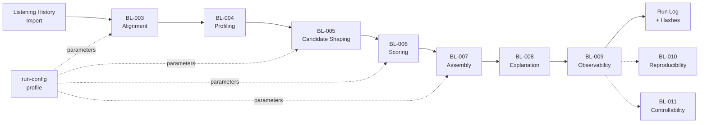
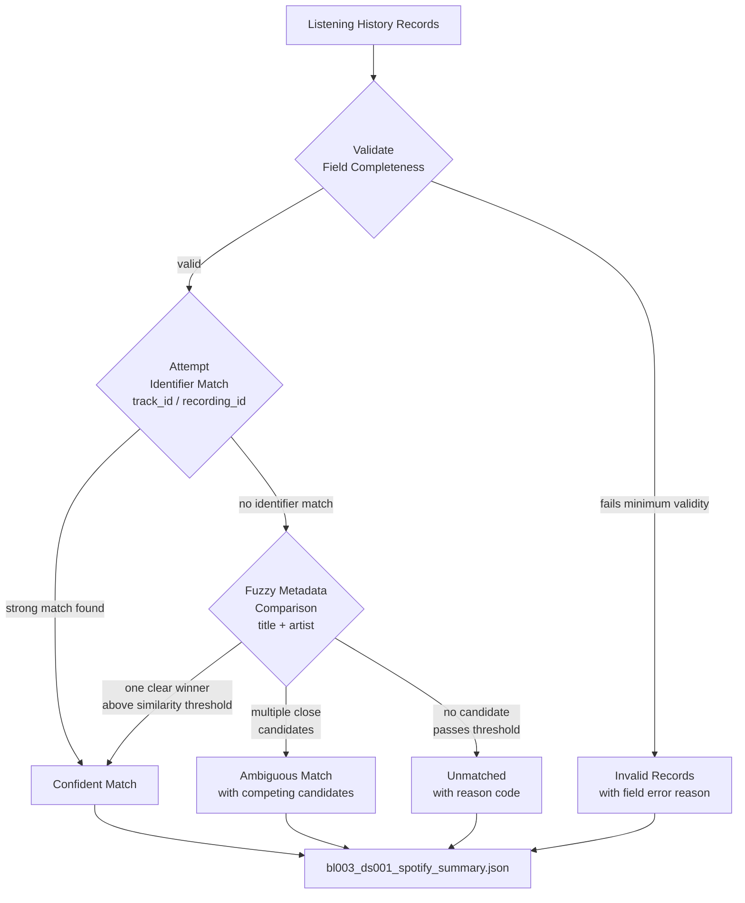
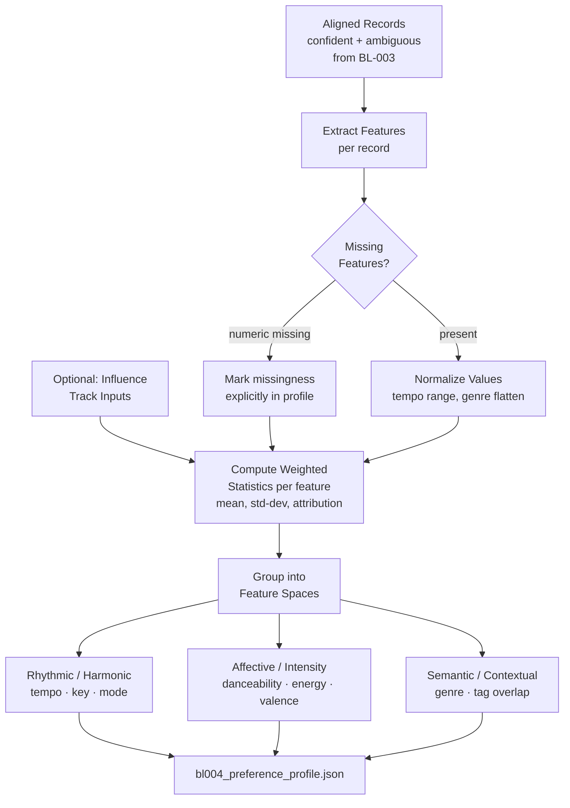
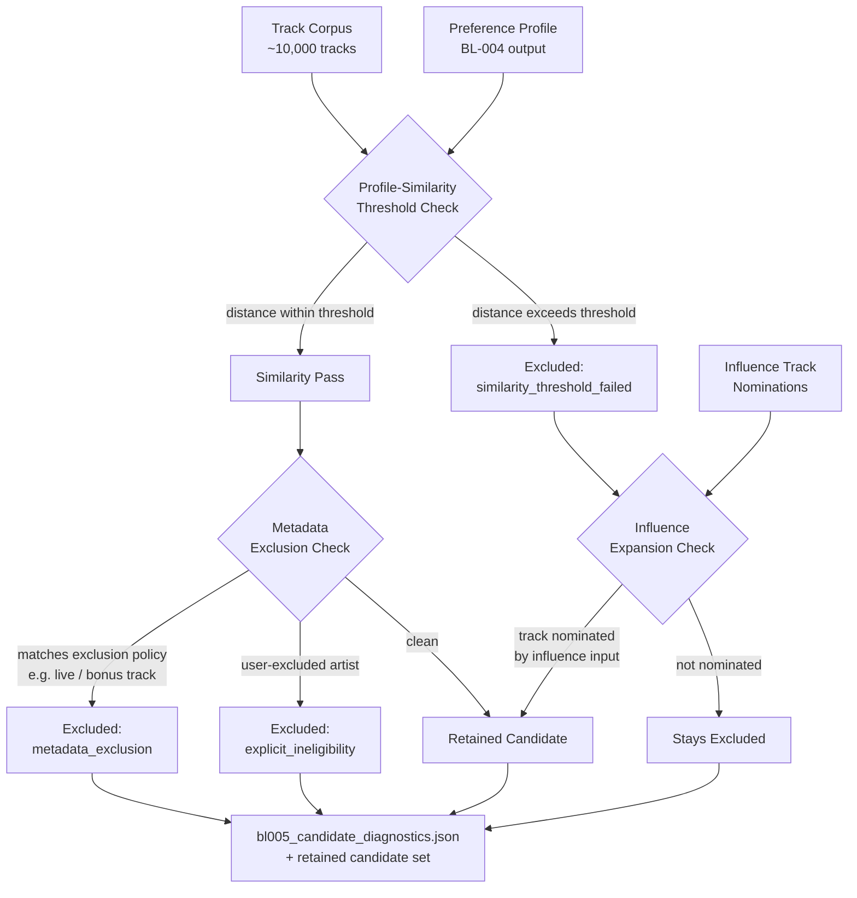
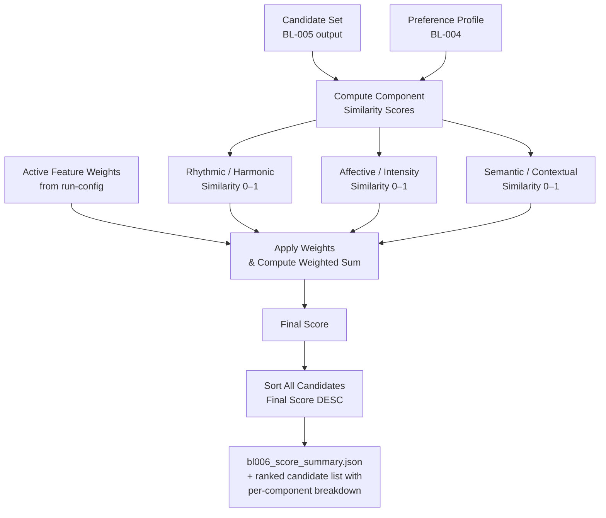
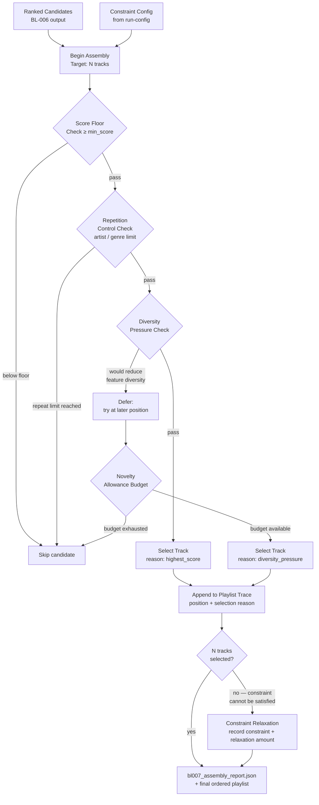
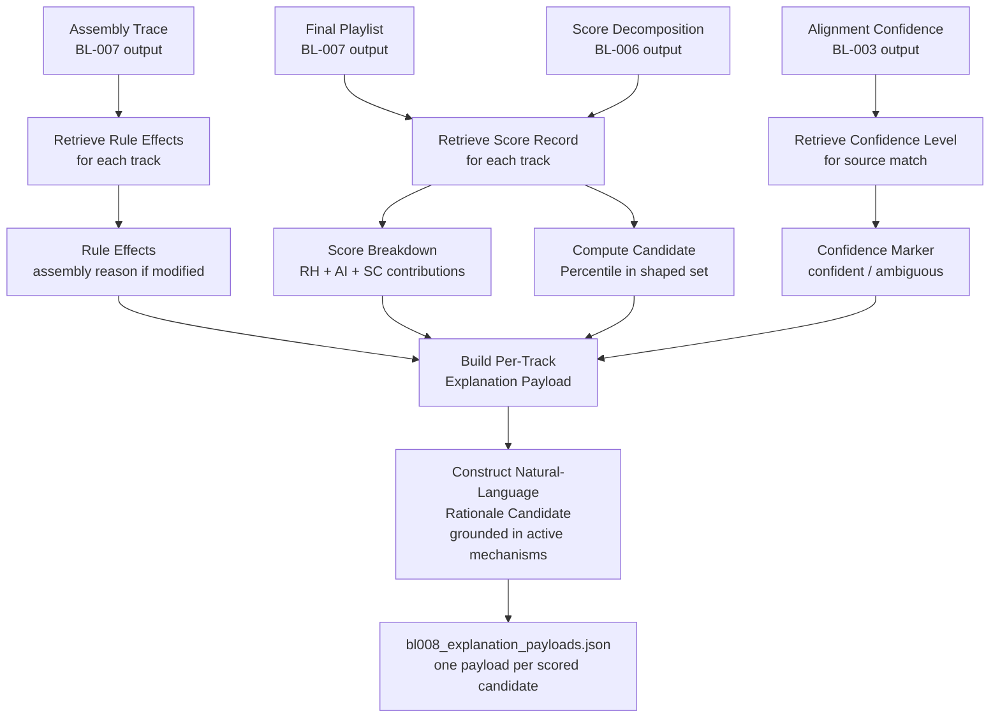
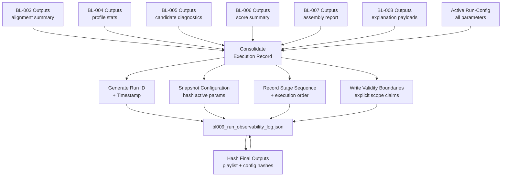
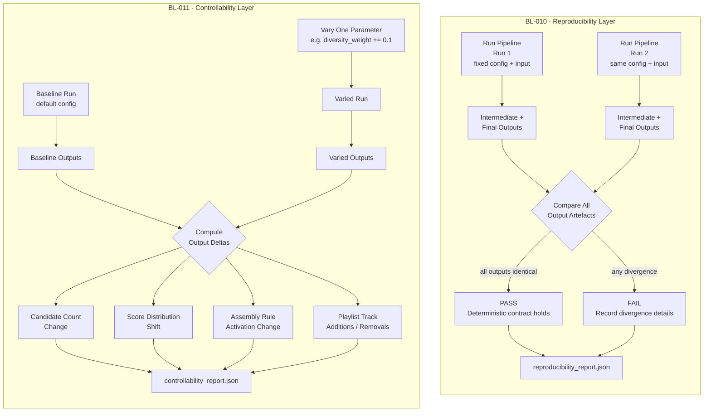
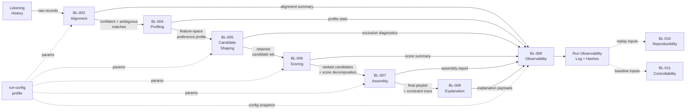

# Chapter 4: Implementation Architecture and Evidence Surfaces

## 4.1 Chapter Aim and Scope

This chapter reports how the design committed in Chapter 3 was realised as an executable pipeline and identifies the evidence outputs produced by each stage. It does not evaluate whether outputs meet quality criteria. Instead, it specifies what was implemented, how the design properties (transparency, controllability, reproducibility) translate into concrete evidence surfaces, and how information flows from alignment through playlist assembly.

The chapter follows the pipeline architecture in sequence: alignment, profiling, candidate shaping, scoring, assembly, explanation, and run-level observability. For each stage, it describes the design intent from Chapter 3, the implementation realisation, and the evidence artefacts produced. Together, these stages show that the implemented system is not only functionally staged; it is instrumented so that the transparency and controllability objectives declared in Chapter 1 remain visible in the execution record itself.

## 4.2 Design-to-Implementation Bridge

Chapter 3 committed to a deterministic 7-stage pipeline where each stage produces intermediate outputs. This section maps that commitment to the implemented stages and situates the implementation in relation to the specific design properties identified in Chapter 3.

### Technology Positioning

The implementation adopts a deliberately lightweight, locally executable architecture chosen to support traceability and reproducibility over platform scale. This aligns with Chapter 3's position that "the contribution lies in auditable recommendation behaviour, not deployment infrastructure" (Section 3.5). All intermediate results and diagnostics are stored as directly inspectable JSON or CSV artefacts in the local filesystem rather than in opaque database layers or remote services. This choice supports the human-centred trust model in which deterministic, locally reviewable logic is often easier to justify than remote or hybrid execution paths.

This positioning is methodologically important: by keeping the pipeline locally executable and artefact-based, intermediate decisions remain portable and reviewable across runs. A researcher or evaluator can inspect the alignment diagnostics at the point where evidence enters, follow the preference profile construction, observe candidate-space decisions before ranking begins, and trace final outputs back to active mechanisms. None of these inspection points require parsing unfamiliar APIs or database query results.

### Implementation Scope

The implementation encompasses the full pipeline from Chapter 3:
- **Intake & Alignment**: Import and cross-source matching of listening evidence
- **Profiling**: Feature-based preference model construction from aligned evidence
- **Candidate Shaping**: Threshold-based filtering and explicit exclusion tracking
- **Scoring**: Deterministic similarity ranking with decomposable score components
- **Assembly**: Playlist-level constraint application and trade-off rule enforcement
- **Explanation**: Mechanism-linked rationale generation from scoring and assembly logic
- **Observability**: Run-level artefact capturing full execution footprint

Additionally, two optional evaluation layers are included:
- **Reproducibility Layer (BL-010)**: Fixed-configuration replay for consistency verification
- **Controllability Layer (BL-011)**: Parameter-variation testing to observe control effects

Configuration state is managed through a persistent run-config profile that captures feature weights, thresholds, constraint parameters, and execution settings. This converts configuration from a convenience mechanism (as in many systems) into a methodological instrument for reproducibility and controlled-variation testing.

### Pipeline Overview Diagram



*Figure 4.1: Full pipeline sequence from listening history intake through to the observability log. Dashed lines show configuration and evaluation-layer relationships.*

## 4.3 BL-003: Cross-Source Alignment and Evidence Intake

### Stage Diagram



*Figure 4.2: BL-003 alignment decision flow. Every input record exits with an explicit classification — confident, ambiguous, unmatched, or invalid — and unmatched records carry a reason code rather than being silently dropped.*

### Design Intent (from Chapter 3, Section 3.6)

Chapter 3 treated alignment as an explicit design stage rather than hidden preprocessing. The intent is to distinguish confident matches, ambiguous cases, and unmatched records so that uncertainty remains visible at the point where evidence enters the system.

### Implementation Realisation

The alignment stage receives imported listening-history records and systematically matches them against a fixed offline track corpus. Rather than forcing all records into certainty, it follows a fixed evidence order: (1) check minimum field validity, (2) attempt structured identifier matching (track ID, recording ID), (3) fall back to bounded metadata comparison (title, artist), and (4) classify outcomes as confident match, ambiguous match, unmatched, or invalid.

A confident match occurs when a strong identifier-based match is found or when metadata comparison yields one clearly strongest candidate. An ambiguous match occurs when multiple candidates score close enough to remain plausible — these are retained with uncertainty flags rather than silently forced into certainty. Unmatched records are those where no acceptable candidate was found; they are retained with explicit reason categories (no title provided, fuzzy comparison failed, etc.) rather than discarded. Invalid records are those failing minimum validity checks and are surfaced separately.

This stage also preserves absence causality in the final playlist: a track either never entered the candidate set (alignment failure) or entered and was later excluded during filtering or ranking. This prevents explanation output from attributing candidate-space decisions to scoring logic.

### Evidence Artefacts

**Primary output**: `bl003_ds001_spotify_summary.json`

This artefact records key summaries including:
- Match-rate statistics (counts matched by Spotify ID, by metadata fallback, ambiguous matches, unmatched records, invalid records, and seed rows selected)
- Match-rate validation against a minimum threshold (with pass/fail status)
- Unmatched/invalid reason visibility through explicit reason categories in diagnostics output
- Cross-source identifier utilisation (how many matches relied on track ID vs. metadata fallback)

**Example** (from run BL-003, 2026-04-27):
```json
{
  "task": "BL-003-DS001-spotify-seed-build",
  "input_event_rows": 9902,
  "matched_by_spotify_id": 1489,
  "matched_by_metadata": 937,
  "ambiguous_matches": 19,
  "unmatched": 7457,
  "invalid_records": 0,
  "seed_table_rows": 1369,
  "match_rate_validation": {
    "min_threshold": 0.15,
    "actual_match_rate": 0.245,
    "status": "pass"
  }
}
```

This artefact exposes alignment uncertainty at intake. The actual match rate of 24.7% against 9,902 input events — exceeding the 15% minimum threshold — is recorded alongside unmatched, ambiguous, and invalid-category counters. Downstream stages can use this summary to understand the evidence profile passed into BL-004.

## 4.4 BL-004: Preference Profiling from Aligned Evidence

### Stage Diagram



*Figure 4.3: BL-004 profiling flow. Aligned evidence and optional influence inputs feed weighted statistics grouped into three interpretable feature spaces, with missing values marked rather than imputed.*

### Design Intent (from Chapter 3, Section 3.7)

Chapter 3 specified an interpretable feature-space profile built from aligned listening evidence. The intent is to keep the preference model explicit rather than latent, and to operate in the same feature space as later candidate evaluation.

### Implementation Realisation

The profiling stage takes the confident + ambiguous alignment outcomes and builds a weighted feature summary in a defined interpretable space. Features are organized in three groups aligned to Chapter 3:

1. **Rhythmic/Harmonic**: Tempo, key, mode
2. **Affective/Intensity**: Danceability, energy, valence
3. **Semantic/Contextual**: Lead genre, genre overlap, tag overlap

For each feature, the implementation computes weighted statistics (mean, standard deviation, attribution tracking) from aligned listening events. Optional influence-track inputs (explicit user-provided preference corrections) are incorporated into the same feature space so that influence and historical evidence remain commensurable.

Feature preparation standardises values (e.g., tempo range normalization, genre list flattening), handles missingness (missing numeric features marked explicitly), and prepares weighted attributes for downstream similarity computation. The result is a bounded weighted summary in the same candidate-facing feature space used for shaping and scoring.

### Evidence Artefacts

**Primary output**: `bl004_preference_profile.json`

This artefact contains:
- Per-feature statistics (mean, std deviation, min, max) for all three feature groups
- Influence-track contributions clearly marked (so profile impact of user edits is observable)
- Uncertainty markers for features with high missingness or low event counts
- Attribution breakdowns (what proportion of profile confidence came from each listening period or influence source)

**Example** (from run BL-004, 2026-04-22):
```json
{
  "run_id": "BL004-PROFILE-20260422-121808-107462",
  "events_total": 1385,
  "numeric_feature_profile": {
    "danceability": 0.603,
    "energy": 0.644,
    "valence": 0.470,
    "tempo": 121.5
  },
  "top_tags": ["pop", "rock", "indie", "alternative"],
  "top_lead_genres": ["pop", "rap", "rock"],
  "profile_signal_vector": {
    "history_weight_share": 0.9985,
    "influence_weight_share": 0.0015
  }
}
```

This profile makes preference structure transparent. An evaluator can directly inspect what feature weights define the profile, identify which genres dominate, and see how much influence-driven edits shifted the baseline evidence profile.

## 4.5 BL-005: Candidate Shaping and Search-Space Definition

### Stage Diagram



*Figure 4.4: BL-005 candidate shaping flow. Three exclusion pathways operate in sequence; influence-track nominations can recover tracks excluded by the similarity threshold. All exclusion counts are recorded separately.*

### Design Intent (from Chapter 3, Section 3.8)

Chapter 3 specified that candidate shaping should be exposed as an explicit evidence surface. The intent is to expose candidate-generation outcomes directly, following the Chapter 2 observation that candidate-generation stages are often the most consequential but least visible part of a recommendation pipeline.

### Implementation Realisation

The candidate-shaping stage takes the preference profile and applies similarity thresholds, metadata-based exclusions, and bounded influence-track expansion to define the searchable candidate set before scoring begins.

The implementation combines three mechanisms:
1. **Profile-similarity thresholds**: Candidates are retained only if their feature distance to the profile falls within defined tolerance
2. **Metadata-based exclusions**: Candidates may be explicitly marked as ineligible (e.g., explicitly marked as bonus tracks, live versions, or user-excluded artists)
3. **Influence-track expansion**: Influence inputs can nominate additional candidates to be retained even if they fall below the similarity threshold

The stage records all three pathways separately so that downstream diagnostics can distinguish whether a candidate was excluded due to similarity, metadata policy, or was explicitly marked ineligible.

### Evidence Artefacts

**Primary output**: `bl005_candidate_diagnostics.json`

This artefact contains:
- Retained candidate count (how many of the corpus passed thresholds)
- Exclusion breakdown by reason (threshold rejection, metadata exclusion, explicit ineligibility, etc.)
- Threshold stringency metrics (what percentile of the corpus does the threshold boundary represent)
- Influence-track contribution (how many candidates were admitted due to influence input)
- Feature-range statistics for the retained set (so evaluators can see what feature space the ranking stage will operate over)

**Example** (from run BL-005, 2026-04-27):
```json
{
  "run_id": "BL005-FILTER-20260427-115650-397861",
  "corpus_total": 109269,
  "candidates_retained": 23257,
  "influence_admitted": 0,
  "rejected": 86012,
  "retention_rate": 0.213,
  "top_exclusion_feature": {
    "feature": "key",
    "threshold": 1.5,
    "failed_count": 65953,
    "failed_share": 0.767
  }
}
```

This artefact records the search-space boundary. With a 21.3% retention rate (23,249 of 109,269 candidates kept), the ranking stage operates over a highly filtered space. It separates two cases directly: alternatives that were ranked lower versus tracks that never entered the candidate set.

## 4.6 BL-006: Deterministic Scoring with Decomposable Components

### Stage Diagram



*Figure 4.5: BL-006 scoring flow. Each candidate receives three component similarity scores that are combined with configurable weights, and the final ranking remains traceable to named mechanisms.*

### Design Intent (from Chapter 3, Section 3.9)

Chapter 3 specified deterministic scoring that combines weighted feature-similarity contributions. The intent is to rank the candidate set while keeping score decomposition visible so that final rankings can be traced to named mechanisms.

### Implementation Realisation

The scoring stage applies deterministic similarity functions to each candidate in the shaped set. Scores are built as weighted sums of named feature-similarity components so that the final ranking is decomposable at track level.

The implementation computes:
1. **Feature-similarity scores**: For each of the three feature groups (rhythmic/harmonic, affective/intensity, semantic/contextual), compute distance metrics normalized to a 0–1 scale
2. **Component weighting**: Combine group scores using configurable weights so that users can emphasize (e.g.) semantic similarity over affective properties

Crucially, the stage outputs both the raw final scores and the per-component contributions, so that explanation logic can reference which mechanisms drove specific ranking decisions.

### Evidence Artefacts

**Primary output**: `bl006_score_summary.json` (summary statistics) and `bl006_scored_candidates.csv` (per-candidate detail)

The summary artefact records:
- Score distribution statistics for the full scored set (mean, median, min, max)
- Active component weight snapshot (confirming which features were emphasized in this run)
- Top-ranked candidates with their lead genre and matched genres

The per-candidate CSV records individual score breakdowns and component contributions, allowing later inspection of which mechanisms drove specific ranking decisions.

**Example** (from run BL-006, 2026-04-22):
```json
{
  "candidates_scored": 23249,
  "score_statistics": {
    "max": 0.499997,
    "mean": 0.221697,
    "median": 0.226647,
    "min": 0.055516
  },
  "active_weights": {
    "lead_genre": 0.29,
    "tag_overlap": 0.29,
    "genre_overlap": 0.24,
    "danceability": 0.04
  },
  "top_candidate": {
    "rank": 1,
    "final_score": 0.499997,
    "lead_genre": "pop",
    "matched_genres": "pop|rock|electronic"
  }
}
```

This output records the ranking mechanism in explicit form. The active weights (tag_overlap and lead_genre each at 0.29, genre_overlap at 0.24) show that semantic similarity dominated this run, with the top candidate reaching a score of 0.500 against a corpus mean of 0.222. These values make score-distribution behaviour directly auditable in the run artefacts.

## 4.7 BL-007: Playlist Assembly with Explicit Trade-offs

### Stage Diagram



*Figure 4.6: BL-007 assembly flow. Tracks are evaluated against four constraint gates in sequence; when a constraint cannot be satisfied the relaxation pathway records the shortfall explicitly rather than silently overriding the policy.*

### Design Intent (from Chapter 3, Section 3.10)

Chapter 3 specified that assembly should be a distinct stage where coherence, diversity, novelty, and ordering trade-offs are made explicit as configurable constraints. The intent is to create a clear boundary between track-level merit (scoring) and collection-level construction.

### Implementation Realisation

The assembly stage takes the ranked candidate list and applies playlist-level rules that can preserve, relax, or redirect simple score order when collection quality would otherwise degrade.

The implementation enforces configurable constraints covering:
1. **Repetition control**: Limits on how often the same artist or genre can appear consecutively
2. **Diversity pressure**: Targets for genre or feature-space distribution across the playlist
3. **Novelty allowance**: Budget to include lower-ranked tracks if they offer novel features
4. **Score admissibility**: Constraints on minimum acceptable scores (e.g., no track below 0.3 final score)
5. **Ordering behaviour**: Policies for whether to preserve score order or apply secondary sorting (e.g., by tempo transition or genre shift)

When constraints cannot be satisfied within the target playlist size, the stage activates a relaxation pathway that explicitly records which constraints were relaxed and by how much. This preserves transparency about trade-off decisions.

### Evidence Artefacts

**Primary output**: `bl007_assembly_report.json`

This artefact contains:
- Constraint satisfaction record (which constraints were active, were they satisfied, relaxation amounts)
- Rule-activation counts (how many times repetition control, diversity pressure, etc. modified the simple ranking)
- Playlist trace with decision record (for each position, what candidate was selected and why)
- Trade-off metrics summary (diversity distribution achieved, novelty tracks included, ordering transitions)

**Example** (from run BL-007, 2026-04-27):
```json
{
  "run_id": "BL007-ASSEMBLE-20260427-115706-449344",
  "config": {
    "target_size": 10,
    "min_score_threshold": 0.35,
    "max_per_genre": 4,
    "max_consecutive": 2,
    "novelty_allowance": 0
  },
  "counts": {
    "candidates_evaluated": 23257,
    "tracks_included": 10,
    "tracks_excluded": 23240,
    "novelty_allowance_used": 0
  },
  "rule_hits": {"R1_score_threshold": 22714},
  "relaxation_records": [],
  "playlist_score_range": {"max": 0.499519, "min": 0.355775},
  "genre_counts": {"pop": 2, "rock": 2, "alternative rock": 2, "electronic": 1},
  "normalized_genre_entropy": 0.96957
}
```

This artefact records assembly decisions as explicit data rather than hidden post-processing. The score-floor rule hit 22,714 of 23,257 evaluated candidates, while the report now also captures novelty-allowance usage and an explicit `relaxation_records` array (empty when no relaxation is needed). The run still selects 10 tracks across 7 distinct genres with a near-maximum diversity entropy of 0.970.

## 4.8 BL-008: Mechanism-Linked Explanations

### Stage Diagram



*Figure 4.7: BL-008 explanation flow. Every payload is constructed from active mechanism outputs (score decomposition, assembly trace, alignment confidence) rather than generated post-hoc, ensuring explanations remain attributable to specific pipeline decisions.*

### Design Intent (from Chapter 3, Section 3.11)

Chapter 3 specified that explanation outputs should be generated directly from scoring contributors and assembly-rule effects so that explanations remain mechanism-linked rather than post-hoc narratives.

### Implementation Realisation

The explanation stage generates structured rationale payloads for each track in the final playlist. For each track, the payload records:
1. **Score breakdown**: Which feature-group similarities drove the ranking decision
2. **Component attribution**: How much each of the three feature groups (rhythmic, affective, semantic) contributed
3. **Rule effects**: How assembly constraints modified the simple score-based ordering (if at all)
4. **Confidence marker**: How confident was the alignment stage in the source evidence for this track
5. **Candidate-space positioning**: The track's `score_percentile` within the shaped candidate set — its rank expressed as a percentile across the full scored population before assembly
6. **Relative quality band**: A `score_band` classification (strong, moderate, or weak) derived from `score_percentile`. Tracks in the top 10% of the scored candidate pool are classified as strong; top 50% as moderate; below the 50th percentile as weak. This percentile-relative approach ensures the band reflects meaningful differentiation within the actual scored population rather than a fixed absolute threshold calibrated to a different scoring scale.

These elements are compiled into a structured rationale that can be presented to a user in natural language form but remains grounded in active mechanisms.

### Evidence Artefacts

**Primary outputs**: `bl008_explanation_payloads.json` (per-candidate record for all 23,249 scored tracks) and `bl008_explanation_summary.json` (aggregated summary for the 10 playlist tracks)

The summary artefact records:
- Per-track identification of the primary explanation driver (the score component with highest contribution share)
- Distribution of primary drivers across the playlist

The per-candidate payloads record score breakdowns and component contributions for every scored track, providing the basis for post-hoc inspection of why any candidate was included or excluded.

**Example** (from `bl008_explanation_summary.json`, run BL-008, 2026-04-22):
```json
{
  "run_id": "BL008-EXPLAIN-20260422-121836-255825",
  "playlist_track_count": 10,
  "top_contributor_distribution": {
    "Genre overlap": 4,
    "Tag overlap": 3,
    "Lead genre match": 3
  }
}
```

The summary shows how primary explanation drivers are distributed across the playlist — here, all 10 tracks have a primary driver attributable to one of three semantic components. The companion `bl008_explanation_payloads.json` records per-component contribution shares for every scored candidate, allowing inspection of the specific score breakdown for any included or excluded track. This makes the distinction between score-driven selection effects and assembly-rule effects directly visible.

**Example** (per-candidate payload from `bl008_explanation_payloads.json`, run BL-008, 2026-04-27):
```json
{
  "run_id": "BL008-EXPLAIN-20260427-124223-866689",
  "playlist_position": 1,
  "track_id": "1rEkUEBFYEtqDLYaTuElsx",
  "lead_genre": "pop",
  "final_score": 0.499519,
  "score_rank": 1,
  "score_percentile": 100.0,
  "score_band": "strong",
  "why_selected": "Selected at playlist position 1 (score 0.4995) because it shows a strong profile match on Tag overlap, Genre overlap, Lead genre match.",
  "primary_explanation_driver": {
    "component": "tag_overlap",
    "label": "Tag overlap",
    "weight": 0.29,
    "contribution_share_pct": 27.5
  },
  "top_score_contributors": [
    {"label": "Tag overlap",      "contribution_share_pct": 27.5},
    {"label": "Genre overlap",    "contribution_share_pct": 25.3},
    {"label": "Lead genre match", "contribution_share_pct": 20.1}
  ]
}
```

This payload illustrates the full mechanism chain: `score_percentile` (100.0) places this track at the top of the 23,249-candidate scored pool, and the percentile-aware classifier assigns it a `strong` band. The `why_selected` sentence is generated directly from the same scoring data — it references the band classification and names the top three contributing mechanisms. An evaluator can cross-check every claim in the natural-language rationale against the structured `top_score_contributors` array.

## 4.9 BL-009: Run-Level Observability and Full Execution Footprint

### Stage Diagram



*Figure 4.8: BL-009 observability flow. All prior stage outputs and the active configuration feed a consolidation step that produces a single run record with hashed output identifiers, enabling reproducibility comparison and controlled-variation analysis.*

### Design Intent (from Chapter 3, Section 3.11)

Chapter 3 specified that observability should capture a full execution record spanning input intake, alignment diagnostics, profile construction, candidate shaping, scoring, assembly, and configuration state. The intent is to make the full execution footprint inspectable so that reproducibility and controllability claims can be evaluated.

### Implementation Realisation

The observability stage consolidates intermediate results from all prior stages into a single run-level artefact. This artefact serves as the central repository for reproducibility verification and controlled-variation comparison.

The run record captures:
1. **Input summary**: What listening history was imported, how many records, alignment quality
2. **Configuration snapshot**: All active parameters (feature weights, thresholds, constraint settings)
3. **Stage sequence**: Which stages were executed and in what order
4. **Intermediate diagnostics**: Key metrics from alignment, profiling, candidate shaping, scoring
5. **Output identifiers**: Final playlist track list, final artefact hashes
6. **Reproducibility markers**: Run ID, timestamp, execution environment context
7. **Validity boundaries**: Explicit non-claims about what the results apply to

### Evidence Artefacts

**Primary output**: `bl009_run_observability_log.json`

This artefact contains the full execution record. Key sections include:
- Run metadata (ID, timestamp, user identifier)
- Input summary (listening history records imported, alignment quality)
- Configuration snapshot (feature weights, thresholds, constraint settings)
- Stage-execution record (which stages ran, in order, execution time per stage)
- Validity boundaries (explicit statement of single-user scope, deterministic replayability scope, etc.)
- Output identifiers (final playlist hash, configuration authority hash)

**Example** (from run BL-009, 2026-04-22):
```json
{
  "run_id": "BL009-OBSERVE-20260422-121845-873914",
  "generated_at_utc": "2026-04-22T12:18:45Z",
  "pipeline_version": "3B3BAB7F2642A8E0AE31B5B5A1867694A80AC8A5CA903A8D46424C7BAEB6957A",
  "upstream_stage_run_ids": {
    "BL-004": "BL004-PROFILE-20260422-121808-107462",
    "BL-005": "BL005-FILTER-20260422-121809-198562",
    "BL-006": "BL006-SCORE-20260422-121829-232217",
    "BL-007": "BL007-ASSEMBLE-20260422-121833-884416",
    "BL-008": "BL008-EXPLAIN-20260422-121836-255825"
  },
  "dataset_component_hashes": {
    "profile/outputs/bl004_seed_trace.csv": "272B3E80B0BB824C00650448F4746FE9A8FC3258B82AEC706EB6331AE703474F",
    "scoring/outputs/bl006_scored_candidates.csv": "BDE3704FF59A59B4C4F2D0070B673272C86783A1CDC95D9D61C03570D15FBBC9"
  },
  "run_caveats": {
    "bl003_match_rate_actual": 0.2469,
    "bl003_unmatched_events": 7457,
    "bl007_undersized_playlist": false
  }
}
```

This artefact allows a later reviewer to identify which configuration and input produced a given playlist: upstream stage run IDs link each stage's execution, hashed component files show which data versions were active, and run caveats surface known boundary conditions. This record provides the run-level basis for reproducibility and controllability checks.

The run log also records an `output_hashes` block providing flat, stable named references to key output digests (from run BL-009, 2026-04-27):
```json
{
  "output_hashes": {
    "semantics_note": "Compatibility aliases; playlist_track_ids_sha256 is retained for legacy snippets and equals the playlist artifact SHA-256.",
    "playlist_artifact_sha256":      "E4D53B53F1FB9961841D58A246B9D45223652D94312161D7ABEBB5B74C66A7F7",
    "playlist_track_ids_sha256":     "E4D53B53F1FB9961841D58A246B9D45223652D94312161D7ABEBB5B74C66A7F7",
    "run_config_payload_sha256":     "2EDFCEB194B783CAD584CDC8D3968DE5104DE4BD721ACF1E829A9D252F25CD6F",
    "bl006_scored_candidates_sha256": "1B67F82D7D46D307A70970D4727753CEA1F2B4C690C29F0705B548E2D620C8EA",
    "bl004_seed_trace_sha256":       "4931C4B15428F8AF7C3EF932C5C1DB351E70C058F0CB3FFE082515AA8448F407"
  }
}
```

Each key is a named SHA-256 digest for a specific output file. `playlist_artifact_sha256` and `playlist_track_ids_sha256` are equal — the latter is retained as a backwards-compatible alias, as the `semantics_note` field records explicitly. A reproducibility comparison can confirm identical outputs by matching named digest values without diffing full output files.

## 4.10 BL-010 & BL-011: Evaluation Layers for Reproducibility and Controllability

### Stage Diagram



*Figure 4.9: BL-010 (top) verifies deterministic output identity across independent runs under fixed configuration; BL-011 (bottom) isolates single-parameter effects by comparing baseline and varied runs and recording output deltas at each pipeline stage.*

### Design Intent (from Chapter 3, Section 3.12)

Chapter 3 specified two complementary execution modes: baseline replay (fixed-configuration repeat for consistency verification) and controlled-variation (one-parameter-at-a-time testing for effect observation).

### Implementation Realisation

**BL-010 (Reproducibility Layer)**: This stage repeats the main pipeline execution under fixed input and configuration and compares intermediate outputs to verify deterministic stability. It compares alignment summaries, candidate-pool counts, score distributions, playlist ordering, and final output hashes across independent runs.

**BL-011 (Controllability Layer)**: This stage executes the pipeline under controlled single-parameter variations and records how changes cascade through the system. For each variation (e.g., increasing the diversity-pressure setting), it captures output changes at candidate-space, ranking, assembly, and explanation levels.

### Evidence Artefacts

**BL-010 output**: `reproducibility_report.json`

Contains:
- Comparison of alignment summaries across replay runs (confident/ambiguous/unmatched counts identical)
- Candidate-pool cardinality across runs (retained candidate count stable)
- Score-distribution comparison (score statistics reproducible)
- Playlist hash comparison (final ordered output identical)
- Verdict: Pass (all outputs identical) or Fail (with differences recorded)

**BL-011 output**: `controllability_report.json`

Contains:
- Parameter-variation matrix (which parameters were tested)
- For each variation:
  - Candidate-count change
  - Score-distribution shift
  - Assembly-rule activation count change
  - Final playlist difference (which tracks changed position, which were added/removed)
- Control-effect interpretability (can changes be traced to specific mechanisms)

**Automated Verification Infrastructure (BL-013, BL-014)**: The implementation also includes two automated verification components that underpin both evaluation layers. BL-013 is the pipeline orchestration entrypoint that governs stage execution order and validates stage-completion signals; it produces a signed run summary recording which stages completed and in what sequence. BL-014 is a 36-check automated sanity layer that runs after each full pipeline execution and validates explanation fidelity (checking that each `score_band` classification is consistent with the track's `score_percentile`), output-hash stability, cross-stage candidate-count consistency, and assembly-constraint satisfaction. These components run as part of the standard CI guard path and produce machine-verifiable evidence for reproducibility and transparency claims.

## 4.11 Overall Execution Coherence and Evidence Flows

### Cross-Stage Data Flow Diagram



*Figure 4.10: End-to-end evidence flow across all pipeline stages. Solid arrows carry primary evidence; dashed arrows carry configuration and evaluation-layer relationships. Every stage contributes diagnostics to BL-009, ensuring the full execution footprint is captured in one inspectable record.*

The pipeline stages do not operate in isolation. Evidence flows from alignment through to final explanation, with each stage consuming the outputs of the prior stage and generating inputs for the next.

### Stage Handshakes and Evidence Contracts

**Alignment → Profiling**: BL-003 emits confident and ambiguous alignment outcomes; BL-004 consumes these with explicit uncertainty handling so that profile construction is grounded in what evidence was actually available.

**Profiling → Candidate Shaping**: BL-004 emits a preference profile in the same feature space used by all candidates; BL-005 compares candidate features to the profile to determine similarity thresholds.

**Candidate Shaping → Scoring**: BL-005 emits the set of candidates to be ranked; BL-006 applies deterministic scoring only to this shaped set, so ranking operates over an explicit search space.

**Scoring → Assembly**: BL-006 emits ranked candidates with decomposable scores; BL-007 applies playlist-level constraints that may reorder but do not silence the scoring information.

**Assembly → Explanation**: BL-007 emits the final playlist and constraint-activation record; BL-008 traces each selected track back to its scored position and scoring components.

**Full → Observability**: BL-009 consolidates all intermediate outputs and creates a run record suitable for reproducibility verification and controlled-variation comparison.

### Deterministic Execution Contract

Under fixed input and configuration, all of the above stages produce identical outputs across independent runs. This is not a claim about universal determinism (the system does not employ random seeding or stochastic computation, so reproducibility is achievable). It is a concrete design commitment: given the same listening history import and run configuration, the pipeline emits the same playlist and generates the same intermediate diagnostics.

This contract enables the reproducibility layer (BL-010) to check whether the implementation remains stable under repeated fixed runs. It also enables controlled-variation testing (BL-011) to isolate single-parameter effects without confounding variability.

### Configuration Authority and Run Identity

All configuration parameters (feature weights, thresholds, constraint settings) are captured in a persistent run-config file. This file serves as the authoritative record of what settings were active in a given run. The observability record (BL-009) includes a hash of the active configuration, so later comparisons can check whether runs were executed under identical parametrization.

This supports two checks:
1. **Reproducibility verification**: If two runs produce different outputs, comparing configuration hashes immediately shows whether parametrization was identical
2. **Controlled variation**: Documenting the exact parameter change between runs makes it possible to attribute observed output differences to that specific change

## 4.12 Chapter Summary

This chapter has described how the design committed in Chapter 3 was implemented as an executable, evidence-producing pipeline. The implementation realised the design intent in each stage:

- **Alignment** makes uncertainty visible at intake rather than hiding it
- **Profiling** produces an explicit feature-based preference model
- **Candidate shaping** exposes search-space definition as an explicit evidence surface
- **Scoring** decomposes rankings into named feature contributions
- **Assembly** makes trade-off decisions explicit and records when rules override score order
- **Explanation** remains mechanism-linked rather than post-hoc
- **Observability** captures a full execution record suitable for reproducibility and controllability verification

The implementation also includes evaluation layers (BL-010, BL-011) designed to check deterministic execution consistency and to record whether control-surface parameters produce observable effects.

Taken together, these stages show that the implemented artefact is not only functionally staged. It is instrumented so that the transparency and controllability objectives declared in Chapter 1 remain visible in the execution record itself.
