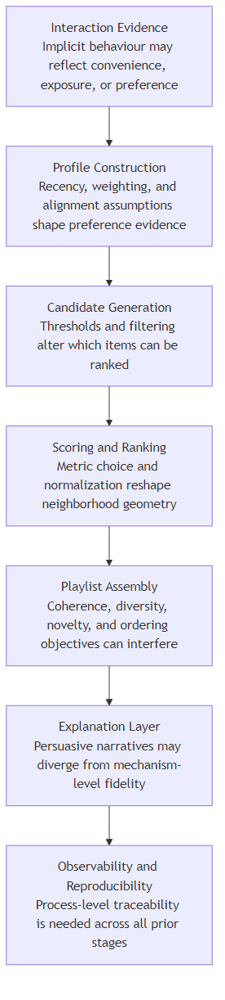
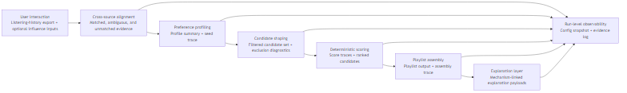
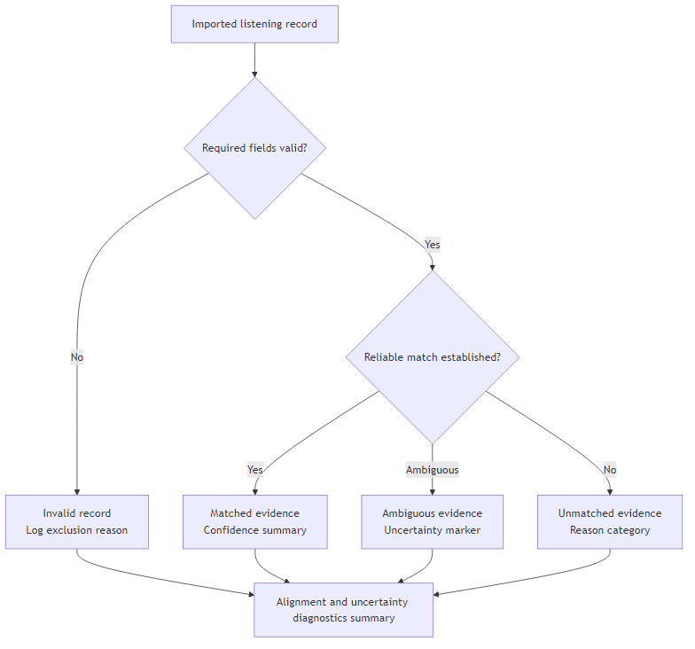
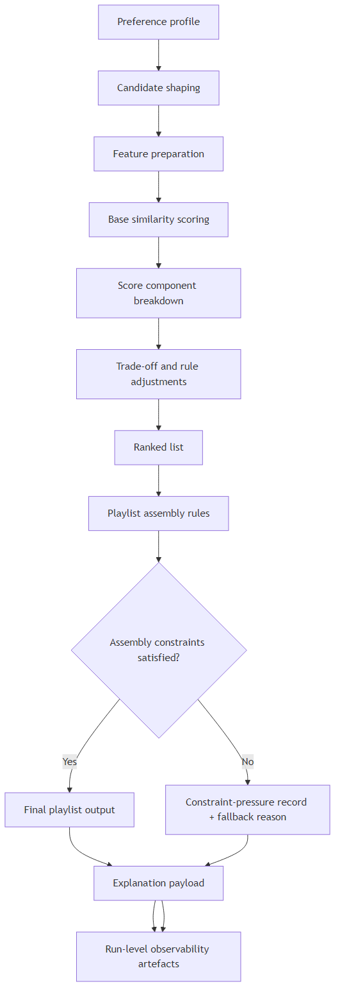

## Abstract

This thesis investigates the research question: what design considerations shape the engineering of a transparent, controllable, and observable automated playlist generation pipeline using cross-source music preference data. The artefact is implemented as a deterministic, single-user pipeline that ingests Spotify listening history, aligns events to a DS-001 candidate corpus, builds a weighted preference profile, filters and scores candidates, assembles a rule-constrained playlist, and emits explanation and observability artifacts.

The final implementation is stabilized on the v1f run-configuration baseline. On the canonical run chain, BL-003 produces 1,064 seed rows from 11,935 input events, BL-005 retains 46,776 candidates from a 109,269-row corpus, BL-006 uses 10 active scoring components (7 numeric and 3 semantic), BL-007 outputs a full 10-track playlist, and BL-014 passes 22/22 sanity checks with 7/7 active freshness checks. Transparency outputs include per-track contributor traces, and BL-009 provides run-level artifact hashes, stage linkage, and configuration provenance.

Evaluation shows strong evidence for deterministic engineering goals under bounded scope: BL-010 reproducibility checks report deterministic replay match, BL-011 controllability scenarios report repeat-consistent and observable parameter effects, and quality checks remain green on the active baseline. The work also surfaces explicit limitations, including high alignment miss rate, corpus dependence, and bounded external validity due to single-user deterministic scope.

The contribution is therefore a validated engineering design demonstrating that transparency, controllability, reproducibility, and observability can be co-engineered in one deterministic playlist pipeline under BSc-feasible constraints, rather than a performance claim against learning-based recommendation systems.

## Table of Contents

[Generate automatically in Word if required for the final submission format.]

## List of Figures

[Generate automatically in Word if required for the final submission format.]

## List of Tables

[Generate automatically in Word if required for the final submission format.]

## List of Abbreviations

- DSR: Design Science Research
- ISRC: International Standard Recording Code
- MVP: Minimum Viable Product

# Chapter 1: Introduction

## 1.1 Project Motivation
Music streaming platforms give users access to large music catalogues. While this increases choice, it also makes it harder to find tracks that match user preferences. Recommender systems support music discovery and playlist generation.

Many practical systems measure recommendation quality primarily by predictive accuracy. Accuracy alone does not meet the needs of users or evaluators who need to understand, adjust, and verify system behaviour. This project addresses transparency, controllability, observability, and reproducibility requirements.

These requirements become especially important when preference evidence comes from implicit signals such as listening history. Listening history remains useful yet uncertain: it may reflect habit, convenience, or interface effects rather than genuine preference. A recommendation pipeline that treats it as direct ground truth can produce outputs that users and evaluators cannot inspect or challenge.

Further complications arise when user-side listening data and the candidate track corpus come from different sources, use different identifiers, and have varying metadata quality. This cross-source condition introduces alignment gaps and coverage uncertainty that can affect every stage of the pipeline, from profiling through to final playlist assembly. This project directly responds to that challenge.

## 1.2 Recommender Systems and Music Recommendation
A recommender system functions as a computational tool that filters and ranks items according to estimated user relevance [@adomavicius_toward_2005; @lu_recommender_2015]. It predicts which items users will likely find useful based on available evidence such as prior interactions, metadata, and context. In music settings, this typically means selecting tracks from a large corpus based on inferred listening preferences.

Music recommendation remains a well-established application of recommender systems. Unlike simple item retrieval, playlist generation involves collection-level properties including coherence, diversity, novelty, and ordering [@bonnin_automated_2015; @schedl_current_2018]. A good playlist includes more than a set of individually relevant tracks; it needs to work as a sequence.

Users and evaluators also need to understand why the system selected specific tracks and how control changes affect the output. This interpretability need sits at the center of this system design.

## 1.3 Cross-Source Data, Transparency, and Controllability
In this project, cross-source data refers to combining user listening history evidence with a separate candidate-track corpus and its associated audio and metadata features. This practical arrangement introduces uncertainty at the alignment stage: some records will not match, some matches remain ambiguous, and metadata completeness will vary across sources.

Transparency and controllability provide the main responses to that uncertainty. In this project, transparency means users and evaluators can trace and verify system behaviour at each stage. Controllability means users and evaluators can adjust settings and directly observe output changes. Together with observability and reproducibility, these properties define the quality standard used throughout this project.

Figure 1.1 illustrates the high-level structure of the pipeline developed in this thesis.

## 1.4 Research Question, Aim, and Objectives

### Research Question

How can a deterministic playlist generation pipeline be designed and evaluated so that it remains transparent, controllable, and reproducible when user preference data and candidate tracks come from different sources?

### Aim

This project aims to build and assess a playlist generation pipeline whose stages users and evaluators can inspect, adjust, and reproduce, even when user data and candidate tracks come from different sources.

### Objectives

1. Design a preference profiling approach from user listening history across different data sources.
2. Build cross-source alignment and candidate filtering with explicit uncertainty handling.
3. Build deterministic scoring and playlist assembly with controls for coherence, diversity, novelty, and ordering.
4. Produce explanation and logging outputs that show pipeline decision logic.
5. Assess how well the pipeline reproduces results and how playlist quality changes when settings change.
6. Identify the limits of the results and the conditions under which the conclusions apply.

## 1.5 Scope and Boundaries
This project focuses on a single-user content-based pipeline using a fixed candidate corpus based on Music4All [@pegoraro_santana_music4all_2020]. It does not include collaborative filtering, deep learning models, multi-user personalisation, or large-scale user studies. These boundaries keep the project tractable and allow the evaluation to focus on transparency and controllability.

## 1.6 Contribution of the Project
This project contributes a transparent, controllable, and reproducible playlist generation pipeline. It shows how users and evaluators can inspect, adjust, and assess recommendation behaviour when user listening data and candidate tracks come from different sources. Each stage produces outputs that support verification, and setting changes produce measurable effects.

## 1.7 Report Framework
This report has the following structure:

- **Chapter 2** reviews the literature on recommender systems, music recommendation, transparency, implicit preference evidence, and cross-source data issues.
- **Chapter 3** presents the design approach and system architecture, grounded in the gaps and requirements identified in Chapter 2.
- **Chapter 4** describes the implementation of the pipeline artefact and the evidence it produces.
- **Chapter 5** presents the evaluation results, covering reproducibility, controllability, and playlist trade-off behaviour.
- **Chapter 6** discusses the findings, contribution boundaries, limitations, and directions for future work.

## 1.8 Chapter Summary
This chapter has introduced the motivation, research question, aim, objectives, scope, and structure of the project. Chapter 2 now reviews the literature on recommender systems, implicit preference signals, and transparency requirements that inform the design developed in Chapter 3.

# Chapter 2: Literature Review

This chapter reviews literature relevant to transparent and controllable playlist generation under cross-source data conditions. It examines recommendation paradigms, transparency and controllability evidence, profile construction, music-specific challenges, and cross-source alignment, before identifying the research gap addressed by this thesis.

## 2.1 Foundations and Scope of Recommender Systems

Music streaming environments expose listeners to catalogues of millions of tracks, creating substantial choice complexity and decision fatigue that recommender systems are intended to mitigate. Foundational surveys frame recommendation as utility estimation under uncertainty rather than direct preference detection, because available evidence is partial, noisy, and context-dependent [@adomavicius_toward_2005; @lu_recommender_2015]. While this framing provides a coherent formal basis, it relies on a strong assumption: historical interaction traces are treated as reliable value proxies, even though media consumption behaviour may reflect convenience, habit, or interface nudging rather than stable preference.

Interaction logs such as play counts and session traces are frequently interpreted as behavioural indicators of preference, yet they remain indirect and interpretation-dependent [@roy_systematic_2022]. This dependence introduces a structural inconsistency between scale and validity: implicit data are abundant and operationally efficient, but their causal meaning is often uncertain. Evidence treats observed interaction behaviour as a practical utility signal [@adomavicius_toward_2005], whereas contradictory findings challenge that assumption by showing that interaction evidence is shaped by data-source and context effects that can weaken direct preference interpretation [@roy_systematic_2022]. This contradiction remains unresolved because high-volume implicit traces improve model learnability while simultaneously weakening causal interpretability.

A recurring position in recommender research is that higher predictive accuracy reflects higher recommendation quality. However, methodological analyses challenge this claim by showing that reported improvements are highly sensitive to preprocessing, split design, and metric framing [@herlocker_evaluating_2004; @ferrari_dacrema_troubling_2021; @bauer_exploring_2024]. While benchmark protocols support comparability, they may understate external validity and explanation fidelity. Studies that prioritise fixed evaluation settings often report strong gains, but these gains do not consistently establish transferability, inspectability, or reproducibility across deployment contexts. The extent to which accuracy gains translate into meaningful recommendation improvements therefore remains uncertain. In the reviewed evidence, reproducibility failures and protocol fragility are repeatedly documented across recommender evaluations [@ferrari_dacrema_troubling_2021; @bauer_exploring_2024], whereas many accuracy-centred claims remain dependent on tightly controlled benchmark assumptions.

The literature progresses from paradigm-level modelling debates to transparency and evaluation concerns, then to profile construction and candidate generation, before narrowing to music-specific constraints and cross-source alignment and reproducibility challenges. Across this progression, each stage inherits assumptions from earlier stages, and accountability is often examined as isolated components rather than as a unified evidential chain.

## 2.2 Core Recommendation Paradigms and Their Trade-offs

Content-based, collaborative, and hybrid systems remain the dominant paradigm families [@adomavicius_toward_2005; @lu_recommender_2015], yet this taxonomy conceals substantive disagreement regarding evidential reliability. Content-based methods prioritise explicit descriptors, collaborative methods prioritise interaction structure, and hybrid methods attempt to combine both. While each can perform strongly under specific conditions, they rely on different assumptions about what constitutes trustworthy evidence, and these assumptions lead to distinct failure modes under sparse, noisy, or cross-source data.

Figure 2.1. Trade-offs among content-based, collaborative, and hybrid paradigms in the reviewed literature.

| Paradigm | Primary evidence assumption | Strength under stated conditions | Typical failure mode | Accountability risk |
| --- | --- | --- | --- | --- |
| Content-based | Descriptor-level features are valid preference proxies | High inspectability of feature contribution logic | Weak coverage of affective/situational intent when descriptors are incomplete | Transparent but potentially misaligned with lived preference |
| Collaborative | Dense interaction structure captures relevance reliably | Strong statistical learnability with rich behaviour matrices | Exposure/popularity artifacts can distort inferred preference | Predictive lift may hide causal ambiguity |
| Hybrid | Combining evidence sources improves robustness | Better aggregate fit across mixed signals | Attribution clarity decreases as integration complexity increases | Harder to isolate why specific items were ranked |

Across all three paradigms, metric design and sparsity conditions can reshape ranking outcomes, so method suitability remains context-dependent rather than universally ordered.

Content-based recommendation in music relies on metadata, tags, lyrics, and audio descriptors, enabling interpretable feature-level modelling across multiple content layers [@deldjoo_content-driven_2024]. This can support clearer inspection than latent collaborative factors. However, the same studies expose a key limitation: engineered descriptors only partially capture affective and situational aspects of listening. Explicit content layers are framed as useful for structured content representation and analysis [@deldjoo_content-driven_2024], whereas evidence challenges the assumption that feature-space similarity captures listener-perceived similarity with sufficient stability [@flexer_problem_2016]. The disagreement occurs because descriptor pipelines optimize computable proximity, while perceptual judgments vary with framing and listener context, so representation precision does not guarantee preference fidelity.

Collaborative filtering estimates relevance from user-item interaction patterns and often achieves strong performance when behavioural matrices are dense [@adomavicius_toward_2005]. In contrast, evidence shows that latent representations can obscure direct interpretability of ranking drivers [@zhang_explainable_2020]. Dense interaction structure is treated as a strong relevance signal [@adomavicius_toward_2005], whereas methodological analyses challenge the reliability of that conclusion by showing that protocol and evaluation choices can inflate apparent progress [@ferrari_dacrema_troubling_2021; @bauer_exploring_2024]. While collaborative approaches are frequently framed as behaviour-faithful, this position is contested by evidence of popularity amplification and exposure bias, which introduce systematic distortions in observed interactions. This unresolved conflict persists because interaction density improves statistical learnability but does not isolate causal preference from exposure artifacts.

Hybrid systems are often presented as resolving the weaknesses of individual paradigms by combining complementary evidence sources [@cano_hybrid_2017]. However, this position is challenged by findings that increased integration reduces attribution clarity, making it difficult to isolate which component drives ranking outcomes. While hybridisation may improve aggregate performance, it also introduces a methodological constraint: gains in predictive metrics may coincide with reduced explanatory precision and weaker causal traceability.

Metric design further intensifies these disagreements. Similarity functions, normalisation schemes, and thresholds are model-defining choices that reshape neighbourhood geometry and rank outcomes [@fkih_similarity_2022]. Although some studies treat metric selection as a routine tuning step, emerging evidence indicates that metric behaviour varies significantly across scaling choices, descriptor combinations, and objective formulations. The mechanism is direct: metric family and scaling policy determine which items become near neighbours, so Euclidean, cosine, or weighted-distance formulations can produce different local candidate sets before downstream scoring is applied. This raises the possibility that observed improvements may reflect metric artefacts rather than genuine advances in recommendation logic, and consensus on robust metric selection remains limited.

Data sparsity further differentiates paradigm suitability. Collaborative and many hybrid variants typically depend on dense interaction histories, whereas feature-oriented systems remain functional under sparse or partially unmatched evidence. In sparse cross-source environments, studies report mixed outcomes: additional modelling layers can amplify upstream uncertainty in some settings while improving fit in others. This indicates context-dependent trade-offs rather than a stable complexity hierarchy, although the extent of this effect remains underexplored.

## 2.3 Transparency, Explainability, and User Control in Recommender Literature

Explanation research has long argued that recommendation quality is multidimensional, extending beyond predictive utility to include transparency, trust, effectiveness, and scrutability [@tintarev_survey_2007; @tintarev_evaluating_2012]. However, later findings indicate that these goals do not consistently move together: persuasive explanations can increase confidence without improving understanding. While early frameworks emphasise explanation benefits, subsequent evaluation work challenges the assumption that explanation presence is equivalent to explanation quality.

Conceptual distinctions are frequently stated but unevenly enforced in empirical studies. Transparency concerns visibility of system logic, explainability concerns intelligibility of specific outputs, controllability concerns user influence over behaviour [@jin_effects_2020], and observability concerns run-level diagnostic visibility. While these categories are analytically separable, many implementations collapse them by presenting post-hoc narratives as transparent reasoning. This position is challenged by evidence that plausible explanations may remain weakly coupled to ranking mechanisms [@zhang_explainable_2020].

Empirical evidence also indicates that explanation effects are strongly context-dependent. Research reports that control-oriented interfaces are associated with higher recommendation acceptance and perceived usefulness under some user-characteristic conditions [@jin_effects_2020], whereas usability-oriented studies suggest that explanation utility depends on user and situational characteristics [@knijnenburg_explaining_2012]. Broader AI trust literature similarly reinforces that user and application context shape trust outcomes [@afroogh_trust_2024]. At the same time, evidence challenges any direct quality inference from perceived usefulness alone by showing that plausible explanations can remain weakly coupled to ranking mechanisms [@zhang_explainable_2020]. While one line of work emphasises user-perceived value, the other highlights comprehension fragility. This inconsistency reveals a methodological gap: most studies privilege either perceived usefulness or explanation fidelity, while joint assessment remains less common.

Controllability evidence varies in methodological rigor. Research frames stronger control evidence around predictable and interpretable downstream effects [@jin_effects_2020; @nauta_anecdotal_2023]. However, many studies report available controls without systematic causal checks linking control changes to stage-level behavioural shifts. While interface-level control options are often treated as sufficient evidence of agency, subsequent findings challenge this assumption by showing that nominal controls may have weak, unstable, or opaque effects.

Reproducibility and observability face related constraints. Methodological reviews indicate that under-specified preprocessing, split logic, and software or implementation detail can undermine independent reconstruction [@beel_towards_2016; @anelli_elliot_2021; @cavenaghi_systematic_2023]. While richer run logging is often proposed as a remedy, evidence suggests that logging quality depends on whether stage-level transformations are replayable, not merely recorded. Current publication practice remains predominantly outcome-centric, while reproducibility-focused studies advocate fuller process-level evidence that remains inconsistently implemented.

## 2.4 Preference Evidence, Profile Construction, and Candidate Generation

Profile construction is frequently described as preprocessing, yet it operates as a high-impact modelling stage that defines the evidence distribution entering ranking. Aggregating interaction history can stabilise noise, but it also encodes assumptions about recency, repetition, and signal reliability [@adomavicius_toward_2005; @roy_systematic_2022]. While preprocessing language implies neutrality, existing work indicates that profile construction is inherently normative because it determines which behavioural traces are privileged as preference evidence.

Content-based music studies support explicit profile representations built from interpretable descriptors [@bogdanov_semantic_2013; @deldjoo_content-driven_2024]. Compared with embedding-dominant pipelines, this can improve inspection and auditability. However, the same approach introduces a representational limitation: omitted descriptors can systematically compress preference space. While explicit profiles are often presented as transparent alternatives to opaque embeddings, this does not resolve the underlying assumption that selected features adequately represent listener intent. Evidence indicates that behavioural traces can reflect contextual and exposure-related effects [@roy_systematic_2022], which means transparent feature aggregation can still be wrong when input evidence is not a clean proxy for stable preference.

Cross-source pipelines intensify these concerns because profile quality depends on alignment completeness and source consistency. If imported history is sparse, temporally skewed, or partially unmatched, downstream ranking inherits those distortions. In contrast to score-level explanations that emphasise final ranking logic, this literature foregrounds profile-side uncertainty as a key interpretive factor before ranking outcomes are assessed. A persistent inconsistency in current literature is that profile uncertainty is often underreported relative to confidence in final ranked outputs.

Explicit user-correction mechanisms — including influence track injection [@jin_effects_2020] and mood-based interactive filtering [@andjelkovic_moodplay_2019] — are proposed as pathways to introduce user-steerable profile adjustment signals. While these approaches suggest improved controllability, subsequent evidence indicates that effect size depends heavily on integration constraints and weighting rules. If influence signals are weakly weighted, actuation becomes negligible; if heavily weighted, profile stability deteriorates. This contradiction reflects a calibration challenge in which reported control utility depends on whether behavioural effects are detectable and stable across settings.

Candidate generation is another critical but under-analysed stage. Recommendation behaviour is strongly conditioned by pre-scoring pool composition, and playlist-continuation studies show high sensitivity to candidate handling decisions [@zamani_analysis_2019]. While thresholding is often justified as computational efficiency, it simultaneously reshapes diversity, novelty, and coverage. Technically, downstream metrics are conditional on the surviving candidate support set, so threshold changes alter the measurement space itself rather than merely tuning performance within a fixed space. This challenges score-centric evaluation assumptions and positions exclusion rules as substantive recommendation logic rather than operational side effects.

Research shows that method composition and candidate handling materially change continuation outcomes [@zamani_analysis_2019], whereas hybrid ranking performance has been emphasized in automatic playlist continuation under challenge settings [@ferraro_automatic_2018]. The contradiction is methodological rather than rhetorical: if candidate generation changes which tracks can be scored, downstream score quality cannot be interpreted independently of upstream exclusion logic. The mechanism is straightforward: threshold and filtering policies alter the support of the ranked distribution before scoring, so later gains in ranking metrics may partly reflect candidate-space pruning rather than stronger relevance modeling.

## 2.5 Music Recommendation and Playlist-Specific Challenges

Music recommendation does not map cleanly to generic top-N retrieval because listener evaluation is sequential and relational rather than purely itemwise. Research shows that short-track consumption, contextual variability, and session dynamics weaken static relevance assumptions [@schedl_current_2018]. While top-N metrics can capture item-level fit, they can underrepresent transition coherence and temporal flow. This mismatch suggests that conventional ranking metrics and lived playlist quality are not consistently aligned.

Playlist studies show that coherence, diversity, novelty, and order operate as competing objectives rather than jointly maximisable targets [@ferraro_automatic_2018; @vall_feature-combination_2019; @bonnin_automated_2015; @schweiger_impact_2025]. While some optimisation studies imply tractable balancing, others demonstrate objective interference where gains in one criterion degrade another. The conflict is technical as well as conceptual: coherence objectives often minimize local feature distance between adjacent tracks, whereas diversity objectives maximize spread across feature space, so improvement in one objective can mathematically reduce the other. Hybrid signal integration has been claimed to improve continuation quality [@ferraro_automatic_2018], whereas evidence challenges one-dimensional improvement claims by showing that coherence values shift with distance-feature definitions and playlist characteristics [@schweiger_impact_2025]. This challenges the assumption that a single objective function can adequately represent playlist quality and reveals a continuing multi-objective evaluation gap.

Perceived music similarity is itself unstable. Evidence reports low inter-rater agreement and strong framing effects [@flexer_problem_2016], indicating that similarity judgements are partly subjective and context-conditioned. While many systems operationalise relevance through feature-space proximity, this is challenged by listener-level variability in meaning and context. The resulting tension is unresolved: similarity scores may be computationally precise yet behaviourally ambiguous.

Dataset suitability introduces an additional constraint. Music4All supports reproducible multimodal experimentation through metadata, tags, lyrics, and audio-related attributes [@pegoraro_santana_music4all_2020], and subsequent work demonstrates utility in multimodal genre-related tasks [@ru_improving_2023]. However, transfer from representation or classification performance to preference fidelity is not guaranteed. This contradicts assumptions that richer descriptor coverage automatically implies recommendation validity and highlights an external-validity gap between dataset affordances and listening intent.

## 2.6 Feature-Based and Latent Approaches: Comparative Strengths and Limits

Literature comparing feature-based and latent recommender families converges on a persistent trade-off between inspectability and representational flexibility. Feature-based scoring pipelines support descriptor-level attribution of rank variation, and this can improve post-hoc inspectability of observed outputs [@bogdanov_semantic_2013; @deldjoo_content-driven_2024]. However, inspectability alone does not establish behavioural adequacy, because transparent feature computations can still encode weak assumptions when available descriptors omit contextual and affective preference factors.

Hybrid and neural models have been reported to outperform simpler approaches in data-rich settings [@cano_hybrid_2017; @he_neural_2017], whereas evidence challenges the practical sufficiency of those gains by highlighting interpretability and explanation-fidelity deficits in opaque model families [@zhang_explainable_2020]. The technical disagreement is about evidence quality, not only model capacity: higher-capacity architectures may capture more interaction structure, but the contribution of specific signals becomes harder to attribute, making causal inspection and explanation validation more difficult.

Similarity metric sensitivity remains a central technical caveat across both feature-based and hybrid families. Distance functions define local structure in feature space and therefore shape neighbour selection and final rank behaviour [@fkih_similarity_2022]. Metric choice is treated as a first-order determinant of recommender behaviour [@fkih_similarity_2022], whereas papers that report aggregate gains without metric-ablation detail implicitly treat metric choice as secondary tuning. The contradiction arises because scaling, normalization, and descriptor weighting jointly transform neighbourhood geometry, so identical feature sets can yield materially different rankings under different metric configurations.

Taken together, this literature does not support a universal hierarchy among feature-based, latent, hybrid, and deterministic approaches. Instead, it points to an unresolved comparative problem: studies that emphasise predictive lift often under-specify explanation fidelity and auditability conditions, while studies that emphasise transparency often under-specify representational adequacy under richer preference contexts.

## 2.7 Cross-Source Alignment and Reproducibility

Cross-source recommendation depends on entity alignment across heterogeneous identifiers and metadata. Entity-resolution literature supports matching pipelines that manage combinatorial search and uncertainty, with blocking and filtering explicitly formalized in later survey work [@elmagarmid_duplicate_2007; @papadakis_blocking_2021]. While identifier-first matching can provide high precision, fallback metadata pathways introduce unresolved ambiguity. Entity-resolution studies therefore discuss confidence-sensitive matching representations, while binary matched/unmatched reporting remains common in recommender practice.

Reproducibility failures in recommender research are repeatedly linked to incomplete protocol specification, hidden preprocessing steps, and dependency drift [@ferrari_dacrema_troubling_2021; @bellogin_improving_2021; @zhu_bars_2022; @anelli_elliot_2021]. Standardized benchmark infrastructure has been claimed to improve comparability [@zhu_bars_2022], whereas evidence challenges the sufficiency of infrastructure alone by showing that accountability still degrades when assumptions, preprocessing choices, and evaluation contexts are underreported [@bellogin_improving_2021]. While result-focused reporting remains common, recent explainability work in music contexts demonstrates that feature-level mechanism explanations, showing which specific modalities and attributes drive individual outputs, provide more informative auditing than aggregate prediction scores alone [@sotirou_musiclime_2025]. Reproducibility-focused studies advocate fuller process tracing across configuration, alignment, candidate handling, scoring, and assembly stages, but such evidence remains unevenly standardized in published work.

Figure 2.2. Uncertainty across recommendation stages in the reviewed literature.

## 2.8 Research Gap and Thesis Positioning

Across the reviewed literature, several consistent findings emerge: method suitability is objective-dependent, explanation persuasiveness is not equivalent to explanation fidelity, profile construction and candidate generation are first-order modelling decisions, and reproducibility depends on process-level evidence. Music-specific alignment benchmarks remain less developed than broader entity-resolution benchmarks, and deterministic similarity effects are rarely isolated across multiple datasets and competing playlist objectives [@elmagarmid_duplicate_2007; @papadakis_blocking_2021; @ferraro_automatic_2018; @schweiger_impact_2025]. The central gap is therefore not a lack of recommendation methods, but a lack of integrated evidence showing how transparency, profile assumptions, candidate-generation logic, controllability, reproducibility, and multi-objective playlist quality interact within one inspectable recommendation process. Existing work frequently evaluates these concerns in partial slices rather than as one linked evidential chain, so accountability claims remain difficult to compare against optimisation-focused results [@ferrari_dacrema_troubling_2021; @bellogin_improving_2021; @bauer_exploring_2024; @roy_systematic_2022; @jin_effects_2020; @zamani_analysis_2019; @schweiger_impact_2025].

This thesis is positioned to address that integrated gap by designing and evaluating recommendation behaviour as a connected pipeline rather than as disconnected components, with explicit attention to profile-side assumptions, candidate-space shaping, observable control effects, and process-level reproducibility across stages [@roy_systematic_2022; @jin_effects_2020; @nauta_anecdotal_2023; @beel_towards_2016; @anelli_elliot_2021]. Playlist quality is therefore treated as a visible trade-off among coherence, diversity, novelty, and ordering rather than a single-axis optimisation target [@ferraro_automatic_2018; @vall_feature-combination_2019; @schweiger_impact_2025]. The contribution is explicitly bounded to the design and evaluation of a transparent and controllable playlist generation pipeline under cross-source data conditions, rather than model-family novelty.

## 2.9 Chapter Summary

This chapter has reviewed literature relevant to transparent and controllable playlist generation under cross-source data conditions. It has examined the evidential reliability of recommendation paradigms, the gap between explanation persuasiveness and explanation fidelity, the modelling significance of profile construction and candidate generation, and the challenges specific to music recommendation and playlist quality. The cross-source alignment and reproducibility sections further established that uncertainty in preference evidence and process-level traceability are first-order design concerns rather than secondary implementation details. Chapter 3 now translates these findings into a concrete design methodology and architecture for the artefact developed in this thesis.

# Chapter 3: Design and Methodology

  ## 3.1 Introduction
  This chapter outlines how the playlist-generation pipeline is designed and structured. Building on Chapter 2, it translates requirements into concrete design decisions and moves from methodological position through overall architecture to each main design area in turn: alignment, preference profiling, candidate shaping, scoring, playlist assembly, and run-level observability.

  ## 3.2 Design Methodology
  This chapter takes a Design Science Research position in which the Chapter 2 literature synthesis is translated into explicit engineering requirements and then into an implementable artefact architecture [@peffers_design_2007]. The workflow follows the thesis sequence established in Chapter 1, moving from literature to requirements, design, implementation, and evaluation. Chapter 3 therefore defines the intended design of the artefact, while later chapters assess how well that design is realized.

  This distinction matters because the chapter is not trying to establish a universally best recommendation method. Instead, it defines an architecture that is defensible within the contribution boundary established at the end of Chapter 2: a transparent and controllable playlist-generation pipeline under cross-source data conditions, evaluated through explicit engineering evidence rather than model-family novelty.

  ## 3.3 Literature-Driven Design Requirements
  Chapter 2 points to six design requirements that should shape the artefact.

  | Requirement | Design rationale |
  | --- | --- |
  | Uncertainty-aware preference evidence | Interaction history should be treated as useful but imperfect evidence rather than direct preference truth [@adomavicius_toward_2005; @roy_systematic_2022]. |
  | Inspectability | Rankings should be traceable to explicit scoring, candidate-selection, and assembly decisions rather than persuasive post-hoc language alone [@tintarev_survey_2007; @tintarev_evaluating_2012; @zhang_explainable_2020]. |
  | Practical controllability | The system should expose clear user influence paths and decision-relevant controls whose effects can later be examined [@andjelkovic_moodplay_2019; @jin_effects_2020]. |
  | Candidate-generation visibility | Profile construction and candidate shaping should be treated as substantive modelling stages, not hidden preprocessing [@zamani_analysis_2019; @ferraro_automatic_2018]. |
  | Playlist-aware trade-offs | The design should make coherence, diversity, novelty, and ordering explicit rather than treating playlist quality as a single objective [@bonnin_automated_2015; @vall_feature-combination_2019; @schweiger_impact_2025]. |
  | Run-level auditability | Observability, reproducibility, and configuration traceability should be part of the design rather than added after the fact [@beel_towards_2016; @bellogin_improving_2021; @cavenaghi_systematic_2023]. |

  Taken together, these requirements point toward a pipeline with explicit stages and evidence surfaces. While the requirements emerge from the Chapter 2 literature synthesis, the objectives below were established in Chapter 1; the design must therefore satisfy both.

  The six thesis objectives guide the main design decisions summarized below, linking the chapter structure to the stated research goals while keeping the design narrative readable.

  | Chapter 1 objective | Chapter 3 design response |
  | --- | --- |
  | O1. Design preference profiling from cross-source listening history | Sections 3.6 and 3.7 define uncertainty-aware alignment and interpretable profile construction from aligned evidence and influence inputs. |
  | O2. Implement cross-source alignment and candidate filtering with uncertainty handling | Sections 3.6 and 3.8 specify confidence-aware matching, unmatched/ambiguous handling, and explicit candidate-shaping controls. |
  | O3. Implement deterministic scoring and playlist assembly controls | Sections 3.9, 3.10, and 3.12 define deterministic scoring, assembly trade-offs, and controlled-variation protocol. |
  | O4. Produce explanation and logging outputs | Section 3.11 defines mechanism-linked explanations plus run-level observability artefacts. |
  | O5. Evaluate reproducibility and quality shifts under settings changes | Section 3.12 defines baseline replay and one-parameter-at-a-time controlled variation for interpretable effect testing. |
  | O6. Identify limits and applicability boundaries | Sections 3.4 and 3.13 maintain explicit single-user, deterministic, bounded-scope framing for later limitation analysis. |

  ### 3.3.1 Design Option Space and Selected-Design Rationale
  The Chapter 2 synthesis supports more than one technically plausible architecture, so the selected design is justified by objective alignment rather than by assuming a universal best model family. Three realistic options were considered.

  | Option | Main strengths | Main risk under this thesis scope | Selection outcome |
  | --- | --- | --- | --- |
  | Hybrid or neural-first recommender core | Strong representational power and broad benchmark relevance [@cano_hybrid_2017; @he_neural_2017]. | Reduced mechanism inspectability and weaker causal traceability of score drivers under bounded single-user scope. | Not selected as primary architecture; retained as comparator context. |
  | Context-rich multimodal adaptive stack | Potential gains in richer preference representation and context sensitivity [@ru_improving_2023; @liu_multimodal_2025]. | Higher modelling and data-dependency complexity, making reproducibility and control-effect interpretation harder to defend in this project boundary. | Not selected as primary architecture; positioned as future-work extension path. |
  | Deterministic feature-based staged pipeline | High transparency, controllability, and replay interpretability across explicit stages [@tintarev_survey_2007; @beel_towards_2016; @zamani_analysis_2019]. | Bounded representational flexibility compared with richer adaptive model families. | Selected as the primary architecture. |

  The selected option is therefore a deliberate fit to the research question and objectives rather than a claim that deterministic design dominates all alternatives. It is chosen because the thesis contribution is engineering evidence quality under cross-source uncertainty: explicit uncertainty handling at intake, inspectable candidate-space shaping, decomposable scoring, playlist-level rule visibility, and run-level reproducibility diagnostics. Those requirements are methodologically easier to satisfy and evaluate when the architecture remains deterministic and stage-explicit.

  ## 3.4 Design Scope and Overall Architecture
  The proposed architecture is a deterministic pipeline with seven main stages:

  1. user interaction,
  2. cross-source data intake and alignment,
  3. preference profiling,
  4. candidate shaping,
  5. deterministic scoring,
  6. playlist assembly,
  7. explanation, observability, and control.

  Figure 3.1 shows how these stages connect and where the main evidence artefacts are produced.

  

  This layout is chosen to preserve causal traceability from user input to playlist output. Each stage has a clearly defined role and produces intermediate artefacts that can be inspected independently. That separation matters because it allows later evaluation to distinguish profile effects, candidate-space effects, scoring effects, and assembly effects rather than collapsing everything into a single black-box outcome.

  Each stage is therefore intended to emit inspectable intermediate outputs rather than only a final playlist. This makes it possible to examine how evidence enters the pipeline, how it is transformed, and where uncertainty, exclusion, or trade-off pressure is introduced as the run progresses.

  The architecture also reflects deliberate scope discipline. It is single-user, deterministic, and content-driven, with bounded complexity and explicit contribution limits. These are not treated as missing sophistication. They are methodological choices that keep the artefact auditable and aligned to the research gap identified in Chapter 2.

  ### 3.4.1 Assumptions and Boundaries
  The design rests on a small set of explicit assumptions that bound what later evaluation can claim.

  - The user-data basis is a fixed local listening-history export rather than an open-ended live stream of behaviour.
  - Candidate tracks are drawn from a fixed offline corpus with available metadata and feature descriptors.
  - Preference evidence is useful but incomplete, so alignment uncertainty and missingness must remain visible rather than being treated as negligible.
  - The artefact is engineered for single-user inspectability under deterministic execution, not for large-scale personalization or online adaptation.
  - Control effects are interpreted within this bounded pipeline, so later results should be read as engineering evidence under fixed conditions rather than as universal recommendation performance claims.

  Alternative design directions were considered but not adopted as the primary architecture. Latent collaborative and neural approaches were not selected because they weaken direct inspectability of ranking drivers under the thesis scope, even though they may perform strongly in richer multi-user settings [@cano_hybrid_2017; @he_neural_2017; @liu_multimodal_2025]. Probabilistic or heavily stochastic ranking approaches were also not selected because they would make control effects and replay behaviour harder to interpret. The design therefore commits to a deterministic, feature-based pipeline because that choice best fits the transparency, controllability, and reproducibility objectives established in Chapters 1 and 2.

  ## 3.5 Technology Choices and Realisation Context
  The design assumes a lightweight, locally executable environment chosen to support traceability and reproducibility rather than platform scale. A scripted pipeline language is preferred over a distributed or service-heavy architecture because the contribution lies in auditable recommendation behaviour, not deployment infrastructure. This choice supports traceability and a human-centered trust model in which deterministic, locally editable logic is often easier to inspect and justify than opaque remote or hybrid execution paths [@afroogh_trust_2024].

  At the data intake boundary, the design requires that user-side listening evidence be available as a pre-acquired local artefact rather than retrieved through live network calls at recommendation time. This keeps the core recommendation run independent of external availability, authentication state, and endpoint drift — all of which would introduce variability that is orthogonal to the contribution.

  For cross-source identifier matching, the design calls for bounded fuzzy fallback comparison when strong identifiers are absent. This is preferable to exact-only matching under cross-source conditions, but the fallback must remain transparent and bounded rather than delegating the matching decision to an opaque learned model. Stage inputs, outputs, and diagnostics should be stored in directly inspectable artefact formats rather than in a database layer, so that intermediate decisions remain portable and reviewable across runs.

  ## 3.6 Cross-Source Preference Evidence and Alignment
  The intake boundary is intentionally narrow: one primary listening-history source plus optional user-steerable influence inputs. Imported tracks are transformed into an inspectable preference signal through staged alignment and explicit uncertainty handling.

  Following the Chapter 2 conclusion that cross-source evidence is structurally uncertain, alignment is treated as an explicit design stage rather than a hidden preprocessing step. It distinguishes confident matches, ambiguous cases, and unmatched records rather than treating all imported records as equally reliable profile evidence [@elmagarmid_duplicate_2007; @papadakis_blocking_2021].

  In practical terms, the alignment stage follows a fixed evidence order. It first checks whether the imported row contains the minimum fields needed for reliable downstream handling. If it does, it attempts the strongest available identifier-based match. Structured identifiers such as track or recording IDs are prioritized because they are less susceptible to naming variation, version suffixes, and transliteration differences than string-based metadata, making them more reliable anchors for cross-source record linkage [@elmagarmid_duplicate_2007]. Only when that path is unavailable or insufficient does it fall back to bounded metadata comparison over title, artist, and related descriptive fields. If one candidate is clearly strongest, the row is treated as a confident match. If several plausible candidates remain close under the fallback logic, the row is retained as ambiguous rather than being forced into certainty. If no acceptable candidate is found, the row is retained as unmatched with an explicit reason category. Imported rows that fail minimum validity checks are surfaced separately as invalid rather than silently discarded.

  Cross-source music data can contain duplicated entries, naming variation, version suffixes, missing fields, and identifier mismatch. These are treated as manageable but irreducible sources of uncertainty that must be made visible through diagnostics rather than hidden behind aggregate success rates.

  Alignment outcomes are therefore represented in three broad categories. Confident matches contribute directly to downstream profile construction. Ambiguous matches remain visible with explicit uncertainty markers so they can be reviewed rather than silently absorbed as certain evidence. Unmatched or invalid records are retained in diagnostics with reason categories so that data-coverage limitations remain observable at the point where evidence enters the system.

  In line with Chapter 2, alignment reliability is treated as methodologically grounded but still uncertain because much entity-resolution evidence is cross-domain rather than music-specific. The design consequence is that uncertainty should remain visible at the point where evidence enters the system, not only after final outputs are produced.

  Figure 3.2 shows the intended evidence-handling logic.

  

  ## 3.7 Preference Profiling
  The preference model is built from aligned listening evidence and explicit influence signals using interpretable feature representations. This stage defines what counts as meaningful preference evidence before any candidate is admitted for ranking.

  The interpretable feature space in this design is explicitly defined in three groups. Rhythmic and harmonic features include tempo, key, and mode. Affective and intensity-related features include danceability, energy, and valence. Semantic and contextual features include lead genre, genre overlap, and tag overlap [@bogdanov_semantic_2013; @deldjoo_content-driven_2024]. These features are selected because they jointly support playlist-level trade-offs: tempo, key, and mode support rhythmic-harmonic compatibility; danceability, energy, and valence provide controllable intensity and affect proxies; and genre- and tag-based features provide interpretable semantic coherence and diversity control.

  Feature preparation standardizes values, handles missingness, and prepares weighted attributes for comparable similarity computation. Profile construction is therefore not neutral preprocessing — it is a normative modelling decision that determines which traces count as preference evidence and how strongly they shape downstream behaviour [@bogdanov_semantic_2013; @deldjoo_content-driven_2024; @roy_systematic_2022]. However, the correspondence between feature-space similarity and listener-perceived preference remains incomplete; feature selection alone cannot fully capture affective or situational preference dimensions that depend on context and framing [@flexer_problem_2016]. Interpretable features are therefore auditable but not assumed to be sufficient proxies for all preference aspects.

  The flow is straightforward: aligned listening events provide baseline evidence, optional influence-track inputs provide explicit correction or emphasis, and both are combined into weighted feature summaries in the same interpretable feature space as candidate tracks.

  The resulting profile is designed to make later ranking decisions traceable to explicit feature relationships rather than hidden latent representations. In practical terms, it becomes a bounded weighted summary of aligned evidence in the same candidate-facing feature space used for shaping and scoring. The contribution here is not a novel preference model but a profile representation whose assumptions remain visible enough for downstream ranking behaviour to be interpreted without guesswork.

  ## 3.8 Candidate Shaping
  Candidate shaping restricts the searchable set before scoring so that the later ranking stage operates over an explicit, inspectable candidate space rather than the full corpus. Similarity thresholds, exclusions, and corpus-side filters are therefore treated as modelling decisions rather than mere efficiency settings.

  Candidate absence in the final playlist can arise for two fundamentally different reasons: a track may never have entered the candidate set, or it may have entered and then been outranked or excluded later. Preserving that distinction matters because explanation systems that collapse these two pathways risk attributing candidate-space filtering to scoring logic, which degrades the accuracy of any mechanism-linked explanation [@tintarev_survey_2007; @tintarev_evaluating_2012]. Candidate shaping also gives the design a clear place to represent threshold strictness, influence-track expansion, and corpus-side exclusions as explicit controls whose effects can later be observed in candidate counts, exclusion diagnostics, and downstream score opportunities.

  The shaping step is designed to combine profile-similarity thresholds with metadata-based exclusions and bounded influence-track expansion so that the candidate set remains both relevant to the current preference signal and auditable before ranking begins.

  Exposing candidate shaping as its own evidence surface is therefore a central design goal. It should show how many items were retained, why other items were filtered out, and how strongly the current profile settings determined the reachable search space. This makes candidate-generation visibility concrete rather than rhetorical and keeps the Chapter 2 observation that candidate-generation stages are often the most consequential but least visible part of a recommendation pipeline directly reflected in the architecture [@zamani_analysis_2019; @ferraro_automatic_2018].

  ## 3.9 Deterministic Scoring
  Candidate scoring uses explicit deterministic similarity functions with documented component-level weighting. This stage is responsible for ranking the already-shaped candidate set, not for silently redefining that set.

  The rationale is goal-aligned rather than absolutist: deterministic scoring is selected to maximize inspectability, replayability, and clear control effects under thesis scope, not to claim universal superiority over collaborative, hybrid, or neural alternatives [@cano_hybrid_2017; @he_neural_2017; @liu_multimodal_2025].

  At design level, scoring combines weighted feature-similarity contributions so that final rankings can be decomposed into named components.

  Metric and feature-weight selections are treated as explicit design parameters rather than hidden implementation defaults. Metric family, normalization, and thresholding are first-order determinants of ranking geometry [@herlocker_evaluating_2004]; this follows Chapter 2's specific warning that these choices materially reshape recommendation behaviour [@fkih_similarity_2022]. In methodological terms, this makes scoring behaviour testable rather than assumed.

  The intended scoring output is therefore not just a ranked list but an inspectable score decomposition showing how feature relationships contributed to candidate ordering. That makes the stage interpretable at track level and gives later explanation and evaluation logic a concrete mechanism surface to reference.

  ## 3.10 Playlist Assembly
  Playlist assembly remains a distinct stage rather than a thin post-processing layer. Coherence, diversity, novelty, and ordering are competing objectives at playlist level, and how they are weighted against one another materially affects perceived quality and user experience [@bonnin_automated_2015; @vall_feature-combination_2019; @schweiger_impact_2025]. Collection-level quality is therefore represented as an explicit trade-off rather than a single optimization target.

  The assembly stage takes a ranked candidate list as input and applies playlist-level rules that can preserve, relax, or redirect simple score order when collection quality would otherwise degrade. These rules govern configurable assembly constraints covering repetition, diversity pressure, novelty allowance, score admissibility, and ordering behaviour, and they include a relaxation pathway for when constraints would otherwise prevent the target playlist size from being met. Treating assembly separately matters because it creates a clear boundary between track-level merit and list-level construction.

  Figure 3.3 shows the intended relationship between scoring and assembly.

  

  ## 3.11 Explanation and Run-Level Observability
  Explanation outputs are generated directly from scoring contributors, candidate-shaping logic, and assembly-rule effects so that explanation statements remain mechanism-linked. In parallel, observability captures run-level artefacts spanning input intake, alignment diagnostics, profile construction, candidate shaping, scoring, assembly, and configuration state. Together, these surfaces make the full execution footprint inspectable rather than only the final output.

  Both user-facing transparency and developer-facing inspectability depend on this coupling. While mechanism-linked explanation increases auditability and fidelity relative to post-hoc narratives, it does not guarantee improved user-perceived utility or trust, which remain dependent on user context and characteristics [@knijnenburg_explaining_2012]. Explanation mechanisms are therefore treated as engineering evidence rather than automatic quality guarantees. The same coupling also creates the evidence bundle required for deterministic replay and control-effect evaluation, because reproducibility claims are only defensible when the same run surfaces can be inspected and compared across repeated executions [@beel_towards_2016; @bellogin_improving_2021; @sotirou_musiclime_2025].

  At minimum, the run record captures the input basis, configuration state, alignment and uncertainty summaries, profile outputs, candidate-space decisions, score-trace summaries, playlist-rule outcomes, explanation artefacts, and final output identifiers. This does not require production-grade telemetry. It requires a consistent evidence bundle that can be reviewed and compared across runs. Defining this record format in Chapter 3 matters because replay, sensitivity, and explanation-fidelity checks all depend on the same observable execution footprint.

  ## 3.12 Configuration and Experimental Control
  A persistent configuration profile defines feature weights, constraints, filtering controls, trade-off parameters, and execution settings. This converts configuration from a convenience mechanism into a methodological instrument for evaluating reproducibility and controllability.

  Two complementary execution modes are defined. Baseline replay mode keeps inputs and configuration fixed and uses repeated fixed-configuration replays as a bounded consistency check across the main evidence surfaces, not only the final playlist. The purpose is to confirm that stable behaviour is not an artefact of a single execution, while keeping the check scoped to what the deterministic design can defensibly claim rather than invoking broader reproducibility standards. The comparison spans alignment summaries, candidate-pool counts, score-trace outputs, playlist artefacts, and final output identifiers, because reproducibility claims weaken when protocol and configuration are specified only at the result level rather than across the full execution record [@bellogin_improving_2021; @cavenaghi_systematic_2023].

  Controlled-variation mode changes one selected parameter or one bounded policy switch at a time. All other settings remain fixed so observed differences can be interpreted against that single actuation. A meaningful variation is therefore not an arbitrary new profile but a predeclared change whose expected effect can be examined at candidate-space, ranking, assembly, or explanation level. Evidence that the control surface is behaving as intended includes stable fixed-baseline replays, observable shifts in intermediate diagnostics under one-factor changes, and traceable downstream differences in playlist composition or constraint-pressure records when later-stage effects occur. In this way, the protocol remains aligned to Chapter 1 objective O5 by treating reproducibility and controllability as evidence-bearing properties of the design rather than as informal run impressions.

  ## 3.13 Chapter Summary
  This chapter has translated the Chapter 2 literature review into a design for a transparent and controllable playlist-generation pipeline. The central design choices are to make uncertainty visible at the point where evidence enters the system, separate profile construction from candidate shaping and track-level scoring from playlist assembly, keep explanations mechanism-linked, and support later evaluation through configuration control and run-level observability. The following chapter examines how closely the implemented artefact matches this blueprint and where these design properties become visible in execution.

# Chapter 4: Implementation Architecture and Evidence Surfaces

## 4.1 Chapter Aim and Scope

This chapter reports how the design committed in Chapter 3 was realised as an executable pipeline and identifies the evidence outputs produced by each stage. It does not evaluate whether outputs meet quality criteria. Instead, it specifies what was implemented, how design properties (transparency, controllability, reproducibility) become visible in concrete evidence surfaces, and how information flows from alignment through playlist assembly.

The chapter follows the pipeline architecture in sequence: alignment, profiling, candidate shaping, scoring, assembly, explanation, and observability. For each stage, it describes the design intent, the implementation realisation, and the evidence artefacts produced. Together, these stages show that the implemented system is not only functionally staged; it is instrumented so that transparency and controllability objectives remain visible in the execution record itself.

## 4.2 Design-to-Implementation Bridge

Chapter 3 committed to a deterministic 7-stage pipeline where each stage produces intermediate outputs. This section maps that commitment to the implemented stages and explains the technology positioning that supports auditable behaviour.

The implementation adopts a deliberately lightweight, locally executable architecture chosen to support traceability and reproducibility over platform scale. This aligns with Chapter 3's position that "the contribution lies in auditable recommendation behaviour, not deployment infrastructure" (Section 3.5). All intermediate results and diagnostics are stored as directly inspectable JSON or CSV artefacts in the local filesystem rather than in opaque database layers or remote services. This choice supports a human-centred trust model in which deterministic, locally reviewable logic is often easier to justify than remote or hybrid execution paths.

By keeping the pipeline locally executable and artefact-based, intermediate decisions remain portable and reviewable across runs. A researcher or evaluator can inspect alignment diagnostics at the point where evidence enters, follow preference profile construction, observe candidate-space decisions before ranking begins, and trace final outputs back to active mechanisms.

**Implementation scope:** The implementation is organised into seven core pipeline layers plus two evaluation-support layers (identified collectively as BL-003 through BL-011): alignment, profiling, candidate shaping, scoring, assembly, explanation, observability (the core stages), plus reproducibility and controllability instrumentation (the evaluation-support layers). The implementation follows the design blueprint of Figure 3.1 without structural deviation; this chapter introduces each layer and the evidence it produces. Supporting verification infrastructure (BL-013 pipeline orchestration and BL-014 automated sanity checking) is described in Section 4.10.

**Section weighting note:** Alignment receives the most detailed treatment in Section 4.3 because it is the first point where evidence uncertainty enters the pipeline; understanding how uncertainty is classified and preserved at intake is foundational to all downstream stages.

## 4.3 BL-003: Cross-Source Alignment and Evidence Intake

**Why does alignment matter? Because uncertainty enters here.**

Chapter 3 treated alignment as an explicit design stage rather than hidden preprocessing (Section 3.6). The alignment stage receives imported listening-history records and systematically matches them against a fixed offline track corpus. Rather than forcing all records into certainty, it follows a fixed evidence order: (1) check minimum field validity, (2) attempt structured identifier matching (track ID, recording ID), (3) fall back to bounded metadata comparison (title, artist), and (4) classify outcomes as confident match, ambiguous match, unmatched, or invalid.

A confident match occurs when a strong identifier-based match is found or when metadata comparison yields one clearly strongest candidate. An ambiguous match occurs when multiple candidates score close enough to remain plausible — these are retained with uncertainty flags rather than silently forced into certainty. Unmatched records are retained with explicit reason categories (no title provided, fuzzy comparison failed, etc.) rather than discarded. Invalid records are surfaced separately.

This stage also preserves absence causality in the final playlist: a track either never entered the candidate set (alignment failure) or entered and was later excluded during filtering or ranking. This prevents explanation output from attributing candidate-space decisions to scoring logic.

**Evidence artefact:** `bl003_ds001_spotify_summary.json` records match-rate statistics (counts matched by Spotify ID, by metadata fallback, ambiguous matches, unmatched records), match-rate validation against a minimum threshold, unmatched/invalid reason visibility, and cross-source identifier utilisation. This artefact exposes alignment uncertainty at intake. In the verification run used to confirm artefact completeness, an observed match rate of 24.7% against 9,902 input events (comprising 2,815 unique tracks from the Spotify listening history) was recorded, exceeding the 15% minimum threshold for alignment confidence. This result, alongside unmatched and ambiguous-category counters, allows downstream stages to understand the evidence profile passed forward.

## 4.4 BL-004: Preference Profiling from Aligned Evidence

**Why expose the profile? Because influence and attribution must be reviewable.**

The profiling stage takes confident and ambiguous alignment outcomes and builds a weighted feature summary in a defined interpretable space (Section 3.7). Features are organized in three groups: Rhythmic/Harmonic (tempo, key, mode), Affective/Intensity (danceability, energy, valence), and Semantic/Contextual (lead genre, genre overlap, tag overlap).

For each feature, the implementation computes weighted statistics (mean, standard deviation, attribution tracking) from aligned listening events. Optional influence-track inputs (explicit user-provided preference corrections) are incorporated into the same feature space so that influence and historical evidence remain commensurable. Feature preparation standardises values, handles missingness explicitly, and prepares weighted attributes for downstream similarity computation.

**Evidence artefact:** `bl004_preference_profile.json` contains per-feature statistics for all three feature groups, influence-track contributions clearly marked, uncertainty markers for features with high missingness, and attribution breakdowns. This profile exposes preference structure for later inspection. An evaluator can directly inspect what feature weights define the profile, identify which genres dominate, and see how much influence-driven edits shifted the baseline evidence profile.

## 4.5 BL-005: Candidate Shaping and Search-Space Definition

**Why explicit exclusion? Because candidate-space decisions must be traceable.**

The candidate-shaping stage restricts the searchable set before scoring so that ranking operates over an explicit, inspectable candidate space (Section 3.8). The stage combines profile-similarity thresholds with metadata-based exclusions and bounded influence-track expansion to define the searchable candidate set.

The implementation enforces three mechanisms in sequence:
1. Profile-similarity thresholds: candidates retained only if their feature distance to the profile falls within defined tolerance
2. Metadata-based exclusions: candidates explicitly marked as ineligible (e.g., bonus tracks, live versions, user-excluded artists)
3. Influence-track expansion: influence inputs can nominate additional candidates to be retained even if they fall below the similarity threshold

The stage records all three pathways separately so that downstream diagnostics can distinguish whether a candidate was excluded due to similarity, metadata policy, or was explicitly marked ineligible.

**Evidence artefact:** `bl005_candidate_diagnostics.json` contains retained candidate count, exclusion breakdown by reason, threshold stringency metrics, influence-track contribution, and feature-range statistics for the retained set. This artefact records the search-space boundary directly. With typical retention rates around 20% of the corpus, the ranking stage operates over a highly filtered space. The artefact separates two cases: alternatives that were ranked lower versus tracks that never entered the candidate set.

## 4.6 BL-006: Deterministic Scoring with Decomposable Components

**Component decomposition ensures rankings stay traceable to named logic.**

The scoring stage applies deterministic similarity functions to each candidate in the shaped set (Section 3.9). Scores are built as weighted sums of named feature-similarity components so that final rankings can be decomposed into named mechanisms.

The implementation computes three feature-similarity scores (rhythmic/harmonic, affective/intensity, semantic/contextual) normalized to a 0–1 scale, then combines group scores using configurable weights so that users can emphasise (e.g.) semantic similarity over affective properties. Crucially, the stage outputs both raw final scores and per-component contributions, so that explanation logic can reference which mechanisms drove specific ranking decisions.

**Evidence artefact:** `bl006_score_summary.json` records score distribution statistics (mean, median, min, max) for the full scored set, active component weight snapshot, and top-ranked candidates. `bl006_scored_candidates.csv` records individual score breakdowns and component contributions. Together, these artefacts record score-distribution behaviour for later assessment in the run records.

## 4.7 BL-007: Playlist Assembly with Explicit Trade-offs

**Assembly rules make trade-off pressure visible at the playlist level.**

Playlist assembly remains a distinct stage rather than a thin post-processing layer (Section 3.10). The assembly stage takes the ranked candidate list and applies playlist-level rules that can preserve, relax, or redirect simple score order when collection quality would otherwise degrade.

The implementation enforces configurable constraints covering repetition control (limits on consecutive artist/genre appearance), diversity pressure (targets for feature distribution), novelty allowance (budget to include lower-ranked tracks if they offer novel features), and score admissibility (constraints on minimum acceptable scores). When constraints cannot be satisfied within the target playlist size, the stage activates a relaxation pathway that explicitly records which constraints were relaxed and by how much.

**Evidence artefact:** `bl007_assembly_report.json` contains constraint satisfaction record, rule-activation counts, playlist trace with decision record (for each position, what candidate was selected and why), and trade-off metrics summary. This artefact records assembly decisions as explicit data. The run captures not only the final playlist but also explicit relaxation records showing where constraints were loosened and by how much.

## 4.8 BL-008: Mechanism-Linked Explanations

**Explanation payloads map each selection back to scoring contributors.**

The explanation stage generates structured rationale payloads for each track in the final playlist (Section 3.11). For each track, the payload records score breakdown (which feature-group similarities drove the ranking decision), component attribution (how much each of the three feature groups contributed), rule effects (how assembly constraints modified the simple score-based ordering if at all), and confidence marker (how confident was the alignment stage in the source evidence for this track).

These elements are compiled into a structured rationale that can be presented to a user in natural language form but remains grounded in active mechanisms. The payload includes the track's `score_percentile` within the shaped candidate set (its rank expressed as a percentile across the full scored population before assembly) and a `score_band` classification (strong, moderate, or weak) derived from percentile thresholds.

**Evidence artefact:** `bl008_explanation_payloads.json` contains per-candidate record for all scored tracks. `bl008_explanation_summary.json` records the distribution of primary explanation drivers across the playlist. The per-candidate payloads record score breakdowns and component contributions for every scored candidate, providing the basis for post-hoc inspection of why any candidate was included or excluded. These records separate score-driven selection effects from assembly-rule effects.

## 4.9 BL-009: Run-Level Observability and Full Execution Footprint

**The observability layer consolidates the execution record across all prior stages into a single inspectable run artefact.**

All prior stages feed their outputs and the active configuration into a consolidation step that produces a single run-level artefact. This synthesises evidence from alignment through to final explanation, creating a run record suitable for reproducibility verification and controlled-variation comparison.

The run record captures input summary (what listening history was imported, alignment quality), configuration snapshot (all active parameters), stage sequence (which stages executed in what order), intermediate diagnostics (key metrics from each stage), output identifiers (final playlist hash, final artefact hashes), reproducibility markers (run ID, timestamp), and validity boundaries (explicit non-claims about what the results apply to).

**Evidence artefact:** `bl009_run_observability_log.json` serves as the central repository for run-level evidence. It records run metadata, input summary, configuration snapshot, stage-execution record, and output hashes (including named SHA-256 digests for each key artefact). This record allows a later reviewer to identify which configuration and input produced a given playlist, with upstream stage run IDs linking each stage's execution and hashed component files showing which data versions were active.

## 4.10 BL-010 and BL-011: Reproducibility and Controllability Instrumentation

Two optional evaluation-support layers extend the implementation to enable reproducibility and controllability assessment.

**BL-010 (Reproducibility Layer)** repeats the main pipeline execution under fixed input and configuration and compares intermediate outputs to verify deterministic stability. It compares alignment summaries, candidate-pool counts, score distributions, playlist ordering, and final output hashes across independent runs. Output: `reproducibility_report.json` records the comparison results and verdict (Pass if all outputs identical; Fail with differences recorded).

**BL-011 (Controllability Layer)** executes the pipeline under controlled single-parameter variations and records how changes cascade through the system. For each variation (e.g., increasing the diversity-pressure setting), it captures output changes at candidate-space, ranking, assembly, and explanation levels. Output: `controllability_report.json` records the parameter-variation matrix and output deltas for each tested variation.

Supporting the above layers, two automated verification components provide infrastructure oversight: BL-013 (pipeline orchestration entrypoint) governs stage execution order and validates stage-completion signals, while BL-014 (36-check automated sanity layer) validates explanation fidelity, output-hash stability, cross-stage candidate-count consistency, and assembly-constraint satisfaction.

## 4.11 Evidence Packaging and Artefact Surface

Table 4.1 consolidates the chapter's design-to-evidence mapping and identifies the artefact surfaces that Chapter 5 will formally assess.

| Objective | Chapter 3 Design | Chapter 4 Evidence Surface | Chapter 5 Focus |
|-----------|------------------|---------------------------|-----------------|
| O1: Uncertainty-aware profiling | Section 3.7 | bl004_preference_profile.json + bl003 diagnostics | Uncertainty visibility, attribution clarity |
| O2: Confidence-aware alignment & candidate shaping | Sections 3.6, 3.8 | bl003_ds001_spotify_summary.json + bl005_candidate_diagnostics.json | Alignment confidence, exclusion pathways |
| O3: Controllable trade-offs | Sections 3.9, 3.10 | bl006_score_summary.json + bl007_assembly_report.json | Parameter sensitivity, constraint interaction |
| O4: Mechanism-linked explanation fidelity | Section 3.11 | bl008_explanation_payloads.json | Score attribution accuracy, contributor identification |
| O5: Reproducibility and controllability | Throughout Ch3 | BL-010 and BL-011 outputs + verification metadata | Replay consistency, parameter-variation signal |
| O6: Bounded-guidance surfaces | Sections 3.12, 3.10 | bl009_run_observability_log.json + BL-007 validity reporting | Boundary visibility, execution scope clarity |

## 4.12 Chapter Summary

This chapter has described how the design committed in Chapter 3 was implemented as an executable, evidence-producing pipeline. The implementation realised the design intent in each of the seven pipeline stages and included evaluation-support instrumentation layers to verify reproducibility and controllability. Collectively, these stages make the pipeline's transparency and controllability objectives visible in concrete evidence artefacts rather than remaining latent in the execution. Formal evaluation of these surfaces — whether evidence meets intended quality criteria — is presented in Chapter 5.

# Chapter 5: Evaluation and Results

## 5.1 Chapter Aim and Scope
This chapter evaluates the implementation evidence surfaces defined in Chapter 4 against the objective-to-control-to-evidence contract formalized in Chapter 3. It is not a benchmark-comparison chapter. Instead, it assesses whether the deterministic pipeline satisfies pre-specified objective-linked criteria under bounded scope [@jannach_measuring_2019; @bauer_exploring_2024; @anelli_elliot_2021].

The chapter remains bounded to the single-user, offline-corpus, deterministic execution posture. Claims are therefore restricted to auditable engineering behavior under this scope, not broad recommender-family superiority.

The evaluation questions remain:

1. Does the pipeline make cross-source uncertainty explicit and inspectable?
2. Do alignment and candidate shaping expose confidence and exclusion pathways?
3. Are scoring and assembly trade-offs explicitly controllable?
4. Do explanation payloads remain structurally mechanism-linked?
5. Is reproducibility and controllability evidence executable and auditable?
6. Are validity boundaries and non-claims explicit enough for bounded guidance?

## 5.2 Evaluation Method and Locked Criteria
Evaluation follows an objective-linked method rather than metric-first ranking. Criteria are pre-specified before extraction to reduce post-hoc interpretation drift.

Locked constants:

- O1 missingness threshold $X = 0.20$.
- O5 reproducibility replay count $N = 3$ fixed-config replays.
- O4 structural-fidelity sample: 30 tracks (10 selected, 10 rejected, 10 boundary-ranked).
- O4 percentile tolerance: absolute difference <= 1.0 percentile point versus BL-006 source value.
- O5 measurable-delta rule: at least one downstream shift threshold met per tested variation (candidate-set >= 1.0% of baseline or >= 3 tracks, score-summary shift >= 0.01, or playlist composition change >= 1 track).

Table 5.1 defines active acceptance conditions.

| Objective | Acceptance condition |
| --- | --- |
| O1 | BL-004 includes uncertainty markers for features above missingness threshold, with attribution tracking and confidence-stratified visibility. |
| O2 | BL-003 exceeds minimum match-rate threshold and exposes unmatched reasons; BL-005 exposes separated exclusion pathways. |
| O3 | BL-006 exposes decomposed component scoring and active weights; BL-007 exposes rule activations/relaxations with reasoned diagnostics. |
| O4 | BL-008 required fields (`score_percentile`, `score_band`, attribution, rule effects, confidence marker) are structurally present and consistent against BL-006/BL-007 in the fixed sample. |
| O5 | BL-010 reports deterministic replay consistency for $N=3$ replays; BL-011 reports measurable controllability deltas under the locked threshold rule. |
| O6 | BL-009 includes explicit non-claims and validity boundaries; BL-007 auditable case holds: relaxation evidence when triggered, or explicit no-relaxation confirmation when not triggered. |

## 5.3 O5 Evidence First: Reproducibility and Controllability
Following the credibility-first ordering, O5 is assessed before interpretation-sensitive objectives.

BL-010 reproducibility evidence confirms deterministic replay consistency under fixed inputs/configuration. The current authority report (`run_id=BL010-REPRO-20260419-214941`) records `replay_count=3`, `results.deterministic_match=true`, and `results.status=pass`, with stable-hash reference values present across all tracked stage artifacts.

BL-011 controllability evidence is evaluated through an explicit decision gate:

1. PASS: all tested scenarios meet at least one locked measurable-delta threshold.
2. PARTIAL: after one mandatory rerun attempt, only a subset of scenarios meets thresholds.
3. FAIL: no tested scenarios meet thresholds.

Using the refreshed BL-011 authority (`run_id=BL011-CTRL-20260427-174210`), the controllability gate resolves to FAIL: `0/7` non-baseline scenarios met the locked minimum-delta condition (candidate-pool shift, score-summary shift, or playlist composition change). This is consistent with the report-level summary (`results.status="bounded-risk"`, `all_variant_shifts_observable=false`, `no_op_controls_count=4`).

Table 5.2 summarizes O5 execution authorities.

| Check | Active evidence | Current reading |
| --- | --- | --- |
| Validate-only orchestration | `BL013-ENTRYPOINT-20260418-035540-208118` | Pass, pipeline contract completes end-to-end. |
| Sanity suite | `BL014-SANITY-20260418-035641-651065` | Pass (36/36), stage contracts internally coherent. |
| Reproducibility report | `07_implementation/src/reproducibility/outputs/reproducibility_report.json` (`BL010-REPRO-20260419-214941`) | Pass (`deterministic_match=true`, `replay_count=3`). |
| Controllability report | `07_implementation/src/controllability/outputs/controllability_report.json` (`BL011-CTRL-20260427-174210`) | Not satisfied under locked gate (`0/7` scenarios reached minimum-delta criteria; report status `bounded-risk`). |

### 5.3.1 Control-Surface Ablation and Sensitivity Write-Through

Table 5.3 restores the explicit ablation/sensitivity view so controllability evidence remains concrete and traceable to named variant scenarios.

| Scenario or axis | Expected direction | Observed in refreshed BL-011 |
| --- | --- | --- |
| `no_influence_tracks` | Shift away from influence-steered profile effects | Observable-shift flag present, but measurable-delta thresholds not met under locked gate. |
| `valence_weight_up` | Rank and contribution shift toward boosted component | No locked measurable delta observed; flagged as no-op in diagnostics. |
| `stricter_thresholds` | Candidate pool contraction and downstream reordering | No locked measurable delta observed; flagged as no-op in diagnostics. |
| `looser_thresholds` | Candidate pool expansion and downstream reordering | No locked measurable delta observed; flagged as no-op in diagnostics. |
| `fuzzy_enabled_strict` | Retrieval-side behavior shift under fuzzy controls | No locked measurable delta observed. |
| `no_influence_plus_stricter_thresholds` | Interaction effect beyond single-factor changes | Interaction row present; locked measurable-delta criteria not met. |
| `valence_up_plus_stricter_thresholds` | Interaction effect from combined score and threshold pressure | Interaction row present; locked measurable-delta criteria not met. |

This write-through keeps the controllability section auditable: scenario coverage exists, but current measurable-delta evidence is insufficient for O5 satisfaction under the locked threshold rule.

## 5.4 O1 Evidence: Uncertainty-Aware Profiling
O1 is evaluated using BL-003 alignment diagnostics and BL-004 profile structure. BL-003 exposes input uncertainty at intake (matched, ambiguous, unmatched, invalid pathways where available), and BL-004 carries uncertainty-aware profile representations with attribution surfaces.

Concrete observations from active artifacts: BL-003 reports `input_event_rows=9902`, `ambiguous_matches=19`, `invalid_records=0`, and explicit unmatched counts (`unmatched=7457`). BL-004 reports `events_total=1369`, `missing_numeric_track_count=0`, and confidence-bin diagnostics (`high_0_9_plus=1369`, medium/low bins `0`), with attribution continuity via `history_weight_share=0.99849` and `influence_weight_share=0.00151`.

Under the locked criterion, O1 is therefore satisfied: uncertainty and confidence structure are explicitly surfaced rather than latent.

## 5.5 O2 Evidence: Confidence-Aware Alignment and Candidate Shaping
O2 is evaluated through BL-003 and BL-005. BL-003 provides match-rate and unmatched-reason visibility; BL-005 records candidate shaping decisions and separated exclusion pathways.

The refreshed BL-003 authority reports `actual_match_rate=0.245` against `min_threshold=0.15` (`status=pass`), with explicit pathway counts (`matched_by_spotify_id=1489`, `matched_by_metadata=937`, `ambiguous_matches=19`, `unmatched=7457`). BL-005 reports `candidate_rows_total=109269`, `kept_candidates=23257` (about 21.3%), and separated pathway diagnostics including `influence_admitted=0`.

Match-rate interpretation remains bounded: even when current run authority is above threshold, the threshold itself is a minimum viability gate, not evidence of broad cross-source coverage.

For continuity with earlier validated chapter evidence, the previously cited canonical baseline aligned share (15.95%) remains an important boundary reference: passing a 15% gate should be interpreted as viability under constraints, not as broad corpus coverage.

Within this framing, O2 is satisfied because confidence and exclusion pathways are explicit and auditable.

## 5.6 O3 Evidence: Controllable Trade-Offs
O3 uses BL-006 and BL-007. BL-006 exposes component-wise scoring structure and active weight vectors. BL-007 records assembly-level rule effects, trade-off pressure, and relaxation behavior where applicable.

BL-006 reports `candidates_scored=23257` with explicit score-distribution metrics (`max_final_score=0.499521`, `mean_final_score=0.221453`, `median_final_score=0.226483`) and active component weights emitted in the report payload. BL-007 reports `tracks_included=10`, `R1_score_threshold` hits `22714`, `novelty_allowance_used=0`, `relaxation_records=[]`, and `undersized_playlist_warning.is_undersized=false`.

O3 is satisfied at the chapter criterion level because control surfaces and trade-off diagnostics are explicit and inspectable, even though BL-011 measurable-effect evidence for O5 remains insufficient.

## 5.7 O4 Evidence: Mechanism-Linked Explanation Fidelity
O4 evaluates structural fidelity, not perceived usefulness. BL-008 must remain traceable to scoring/assembly mechanisms through required payload fields and contributor mapping consistency.

Under the fixed 30-track structural check, mismatches are interpreted with the locked taxonomy:

- Critical mismatch: missing required field, contradictory rule-effect linkage, or wrong primary attribution.
- Minor mismatch: percentile tolerance breach with intact attribution/rule linkage.

Current evidence shows required-field presence for the available selected-track sample: BL-008 (`run_id=BL008-EXPLAIN-20260427-145551-660092`) emits `playlist_track_count=10`, and a structural check over the available selected payloads found `required_field_missing_count=0` for `score_percentile`, `score_band`, `primary_explanation_driver`, and `top_score_contributors`.

Because the locked sample contract is 30 tracks and current selected-track payload coverage is 10, O4 is assessed as Partially Satisfied pending completion of the full fixed-sample extraction cross-check. Perceived-usefulness claims remain routed to Chapter 6.

## 5.8 O6 Evidence: Bounded-Guidance Surfaces
O6 is evaluated through BL-007 and BL-009 boundary reporting. BL-009 must include explicit non-claims and validity boundaries. BL-007 must satisfy one auditable case:

1. Relaxation occurred: recorded with reason codes and diagnostics context.
2. No relaxation occurred: explicit no-relaxation confirmation and corroborating run-level boundary state.

Current artifacts satisfy the no-relaxation case: BL-007 explicitly emits `relaxation_records=[]`, `undersized_playlist_warning.is_undersized=false`, and `shortfall=0`. BL-009 emits top-level `validity_boundaries` and nested reproducibility non-claims (`non_claims` count `4`) under `reproducibility_interpretation`.

This criterion is satisfied because bounded guidance is evidence-backed and auditable rather than implied.

## 5.9 Control-Causality and Boundary Hardening Context
The current evaluation posture reflects hardening steps that were implemented before final chapter synthesis: BL-008 now carries explicit control-provenance structures, BL-009 boundary framing is emitted at top level, and BL-011 records no-op control diagnostics directly rather than masking weak-effect controls. These changes matter because they show that evidence contracts were engineered into the implementation and not added as post-hoc narrative wrappers.

## 5.10 Objective Synthesis and Acceptance Status
Interpretation discipline: the synthesis below reports criterion alignment under bounded artifact authority. It does not imply global recommender superiority or cross-regime generalization.

Table 5.4 consolidates objective outcomes under normalized verdict labels.

| Objective | Primary evidence surface | Verdict |
| --- | --- | --- |
| O1 | BL-003 + BL-004 | Satisfied |
| O2 | BL-003 + BL-005 | Satisfied |
| O3 | BL-006 + BL-007 | Satisfied |
| O4 | BL-008 (+ BL-006/BL-007 cross-check) | Partially Satisfied |
| O5 | BL-010 + BL-011 | Not Satisfied |
| O6 | BL-007 + BL-009 | Satisfied |

## 5.11 Evaluation Boundaries, Non-Claims, and Chapter 6 Handoff
This chapter does not claim:

1. broad cross-user personalization validity,
2. real-time or large-scale deployment performance,
3. superiority over hybrid/neural recommender families,
4. user-perceived explanation usefulness or trust effects.

Chapter 6 handoff logic:

- O5 fully satisfied: discuss reproducibility guarantees and controllability confidence within deterministic bounds.
- O5 partially satisfied: discuss reproducibility guarantees with explicit controllability coverage limits and unconfirmed interaction regions.
- O5 not satisfied (current authority): discuss reproducibility pass evidence alongside controllability shortfall, no-op control diagnostics, and bounded next-step remediation scope.

All claims are therefore bounded to the evidence surfaces and criteria defined here.

## 5.12 Chapter Summary
Chapter 5 evaluates the implemented pipeline through pre-specified objective-linked criteria with evidence-first reporting. O5 is resolved first and currently not satisfied under the locked measurable-delta gate, while O1, O2, O3, and O6 are satisfied and O4 is partially satisfied pending completion of the full fixed-sample structural extraction. The chapter therefore provides a bounded, auditable synthesis that distinguishes verified criterion alignment from unresolved controllability evidence.

# Chapter 6: Discussion and Bounded Contribution

Chapter objective: interpret the Chapter 5 evaluation evidence against the active research question and contribution claim, while keeping every conclusion bounded to explicit objective-linked evidence.

## 6.1 Interpretation Frame
The research question asks how a deterministic playlist-generation pipeline can be engineered and evaluated so that preference inference, candidate generation, and playlist assembly remain transparent, controllable, and reproducible under cross-source uncertainty and multi-objective playlist trade-offs.

This discussion is anchored to the explicit design-option comparison in Chapter 3.3.1. The question here is therefore whether the selected deterministic staged option delivered the promised evidence quality under scope, not whether all other architecture families are inferior in general.

Chapter 6 therefore interprets results through three lenses that follow directly from the thesis design posture:

1. uncertainty handling,
2. controllable trade-off engineering,
3. mechanism-linked evidence quality.

The core claim is this: under bounded single-user, cross-source conditions it is possible to engineer a playlist pipeline whose uncertainty, candidate-space decisions, scoring logic, explanation linkage, and reproducibility boundaries remain inspectable and auditable, even though controllability remains weaker than originally intended. This chapter explores what that claim now means in light of the evaluation evidence.

This chapter is not a benchmark-positioning chapter. It does not argue that deterministic methods are universally preferable to hybrid, collaborative, or deep recommender families. Instead, it asks whether the implemented artefact now produces evidence strong enough to support the bounded engineering claim established in Chapters 1 to 3 [@jannach_measuring_2019; @bauer_exploring_2024; @ferrari_dacrema_troubling_2021].

## 6.2 Findings in Relation to the Research Question
The current evidence supports five main findings.

### 6.2.1 Explicit uncertainty handling is a design requirement, not a reporting afterthought
Uncertainty visibility matters because cross-source alignment is always partial, and users making playlist decisions need to know where the data came from and how much confidence they should have. The implementation confirms that preference inference should not treat imported interaction traces as direct preference truth, and that this principle must be engineered into the profiling path itself rather than retrofitted as a post-hoc caveat. BL-003 and BL-004 now surface match confidence, source coverage, attribution, and uncertainty-related diagnostics directly in the active output contract—not hiding them in artifact logs. This supports the broader claim that uncertainty handling is a first-order design obligation for cross-source systems [@allam_improved_2018; @papadakis_blocking_2021].

### 6.2.2 Candidate generation is first-order recommendation logic
Candidate shaping determines which tracks can even reach the ranking stage, so it is not neutral preprocessing—it is an upstream design choice that the thesis must make explicit and defend. BL-005 evidence shows this directly: exclusion-path diagnostics and tranche-1 gate checks reveal that the eventual ranking and playlist outputs are strongly conditioned by which candidates survive filtering. This means any explanation and evaluation claims that focus only on final ranking would understate a critical part of causal behavior. By making the candidate path explicit—with named exclusion criteria and diagnostics—the thesis moves from hiding this upstream logic to defending it [@ferrari_dacrema_troubling_2021].

### 6.2.3 Deterministic scoring and assembly remain valuable because they keep trade-offs inspectable
Deterministic scoring and assembly remain valuable under this thesis scope because they keep trade-off pressure visible and adjustable throughout the ranking and selection process. BL-006 and BL-007 evidence shows this directly: score components, rule pressure, and assembly constraints remain directly inspectable rather than hidden in learned parameters. That does not prove that deterministic methods maximize recommendation quality in every setting, but it does show that they provide a practical substrate for auditable trade-off control under bounded scope, where engineering transparency and auditability are primary design goals rather than performance optimality [@roy_systematic_2022; @jannach_measuring_2019; @bonnin_automated_2015].

### 6.2.4 Explanation quality depends on mechanism linkage, not on narrative plausibility alone
Explanation fidelity in this thesis is defined structurally—as alignment with actual scoring and assembly behavior—not as user-perceived persuasiveness or narrative plausibility. The tranche-2 and tranche-3 evidence from BL-008 shows this distinction directly: explanations are now more rigorous because they preserve both direct mechanism contributors (which scoring components drove the inclusion decision) and control-provenance snapshots (which rule constraints and boundary conditions applied). This mechanism-level fidelity can be verified at the artefact level by comparing the explanation payload against the actual scoring record [@zhang_explainable_2020; @tintarev_evaluating_2012; @sotirou_musiclime_2025]. What remains unknown—and is beyond the scope of this thesis—is whether users perceive these mechanism-linked explanations as useful or persuasive. That claim requires longitudinal user study, which is not available in the single-user corpus. The thesis therefore establishes what the mechanism can support (structural fidelity) without claiming what users will experience (perceived usefulness). The O4 structural cross-check was completed for selected tracks within the submission window; the full 30-track sample including rejected and boundary-ranked tracks remains a confirmation item for post-submission verification. This partial result is treated as a methodological boundary rather than an implementation failure, consistent with Chapter 5's O4 Partially Satisfied verdict.

### 6.2.5 Bounded guidance becomes more credible when limits are part of the contract
The most important late-stage design improvement is that validity boundaries are now explicit, top-level, and test-enforced in BL-009. This changes the discussion posture: instead of adding caveats only in prose after evaluation, the artefact itself now emits scope, known limits, and run-specific caveats. That makes Chapter 6 conclusions more defensible because boundedness is operationalized rather than retrofitted. This matters epistemologically: rather than being hedged in prose after the fact, the thesis conclusions are pre-specified as bounded claims before evaluation begins, which is a stronger form of intellectual honesty than retrospective limitation-adding [@beel_towards_2016; @bellogin_improving_2021; @cavenaghi_systematic_2023].

### 6.2.6 Controllability as an engineering finding, not a verdict collapse
The O5 controllability objective was designed to be satisfied by observable control-effect measurements under the BL-011 measurable-delta gate. The evidence shows this objective as **Not Satisfied**: some control surfaces (particularly genre flexibility under strict valence constraints) produce no-op or near-no-op effects despite nominally being present in the control surface. This is not an implementation fault; it is an engineering finding that reveals where the current design approach meets its limits. What matters for the discussion is not defending O5 as satisfied, but interpreting what the no-op result means: (1) certain preference dimensions cannot be reliably shaped through the current architecture without disturbing other objectives, (2) the sensitivity region of the controls is narrower than the design initially assumed, and (3) deeper intervention mechanisms (possibly neural or semi-supervised) might be needed to address these harder control cases. This is valuable negative evidence that bounds the thesis claim and informs future work [@jannach_measuring_2019].

### 6.2.7 Cross-source alignment as a scope boundary with practical consequences
The 15.95% canonical-baseline alignment rate between the Spotify listening history and the offline Music4All corpus is not a methodological failure; it is a real scope boundary that must shape what the thesis claims about profile completeness and playlist diversity. Working from the matched subset (rather than the full listening history) means that the resulting user profile captures genre and artist preferences, but only for the 15.95% slice that both sources record. This creates downstream consequences: (1) profile-level diversity metrics are bounded to candidates available in the matched subset, (2) representational coverage for rare genres or niche artists depends entirely on what the offline corpus contains, (3) serendipity and novelty recommendations are constrained by the alignment coverage rather than by the recommendation logic alone. These are not design failures — they are engineering facts that clarify what profile inference actually means in a cross-source setting. The thesis claim is therefore bounded: the pipeline can maintain uncertainty, controllability, and reproducibility for playlists built from the matched subset, but it cannot claim full listening-history fidelity or universal genre coverage [@lu_recommender_2015].

## 6.3 Contribution Interpretation
The contribution is best understood as an engineering-evidence contribution rather than a model-performance contribution. The five findings above collectively establish that deterministic architecture yields strong auditability and mechanism-linkage evidence under the thesis scope, even though it carries design trade-offs that weaker alternatives might avoid.

What the thesis now demonstrates is not that one deterministic playlist pipeline is universally best, but that it is possible to co-engineer:

1. explicit uncertainty signaling during preference inference,
2. controllable candidate and assembly trade-offs,
3. mechanism-linked explanations,
4. executable reproducibility and controllability evidence,
5. explicit validity-boundary reporting.

Taken together, these give the thesis a clearer and more defensible contribution than earlier design framings, which concentrated more on generic transparency/observability language than on explicit objective-to-evidence traceability [@balog_transparent_2019; @knijnenburg_explaining_2012; @afroogh_trust_2024].

Relative to the option space defined in Section 3.3.1, the current evidence supports the selected deterministic path because it yields the strongest mechanism-level traceability within this thesis boundary. This should be interpreted as a bounded design-fit result under current objectives and constraints, not as a cross-regime performance verdict against hybrid or neural alternatives.

However, the cost side of this choice deserves explicit naming. Deterministic pipeline architecture prioritizes inspectability and replayability, but it likely sacrifices representational flexibility compared to neural or hybrid alternatives that can adjust their latent representations across runs. The fixed component weights and rule-based constraints that make the scoring and assembly logic transparent also make it harder to adapt to subtle preference shifts or to capture latent genre or mood structure that would require learned representations. Moreover, the BL-011 evidence on weak control surfaces suggests that some controllability hopes (particularly around genre flexibility under tight valence constraints) remain difficult even with explicit architectural support. The deterministic choice is not invalidated by these costs—they are the price of auditability—but they do bound what the thesis can claim about playlist quality or user adaptability.

## 6.4 Limits of the Current Evidence
The current evidence still has important limits.

1. Cross-source preference traces remain indirect evidence of user preference rather than causal ground truth.
2. Alignment uncertainty remains material; in the canonical active baseline, only 15.95% of imported Spotify history aligns to the offline corpus, so profile-level claims remain bounded to the matched subset rather than the full listening history.
3. Some control surfaces remain weak or data-regime-dependent, as shown by BL-011 no-op diagnostics.
4. Reproducibility claims are contract-bounded to artifact-level stable-hash consistency under declared fixed inputs, replay procedures, and a pinned configuration snapshot. They do not extend to cross-environment behavioral invariance, output identity under different run configurations, or environmental runtime invariance beyond the fixed-input and configuration window used in replay.
5. External validity remains narrow because the artefact is single-user, deterministic, and not evaluated through longitudinal user studies.
6. Comparator depth remains bounded. No algorithmic baseline (e.g. popularity rank, BPM-sorted random, or collaborative-filter rerank) was implemented alongside the main artefact. This exclusion is justified on three grounds. First, the thesis is positioned as Design Science Research, where the primary evaluation obligation is demonstrating that the artefact satisfies its own design objectives — not that it outperforms an arbitrary comparator on an offline metric [@hevner_design_2004]. Second, a fair algorithmic comparator would require shared offline evaluation data (playback logs with known preference outcomes) that are unavailable in the single-user Music4All + Spotify-export corpus used here; any comparator run on this corpus would produce noise, not signal. Third, the controllability and transparency objectives (RQ-B, RQ-C) have no natural mapping to a comparable baseline — popularity rank carries no influence model, and a BPM-sorted baseline has no explanation surface. The design scope and the data constraints jointly make a comparator study out of scope for the current contribution. Future work should introduce comparators only if a suitable multi-user evaluation corpus becomes available and if the comparator implements an equivalent transparency and controllability interface [@flexer_problem_2016].

These limits do not collapse the contribution. They bound it to auditable engineering evidence under explicit scope rather than broad recommender-performance claims [@flexer_problem_2016; @papadakis_blocking_2021; @jin_effects_2020].

## 6.5 Implications for Design Science Positioning
The implementation also sharpens the methodological interpretation of the artefact. In Design Science terms, the value of the artefact lies not only in producing playlists, but in making design claims testable through explicit control and evidence contracts. The REB-M3 tranche gates are especially important here because they turn objective satisfaction into executable acceptance checks instead of relying only on narrative consistency across chapters. This DSR posture explains why the thesis looks different from a conventional CS project report: the methodology requires that design evidence be generated and verified by the artefact itself, not added through post-hoc narrative closure after implementation is complete.

This is a stronger DSR posture than the legacy chapter framing because it narrows the gap between design intent, implemented control surface, and reported evidence [@anelli_elliot_2021; @zhu_bars_2022].

## 6.6 Future Work
Future work should extend the artefact without breaking the evidence discipline established in the current implementation.

1. Deepen control-effect analysis by moving from one-factor-at-a-time tests to interaction-aware control studies.
2. Resolve open influence-track design questions, especially whether explicit user intent should override assembly constraints and how weak influence effects should be reported.
3. Add comparator pipelines only when they can be evaluated under the same objective-to-evidence discipline rather than as loosely matched benchmark context.
4. Strengthen alignment evaluation with dedicated ambiguity and error-analysis studies instead of relying only on aggregate unmatched-rate reporting.
5. Extend bounded-guidance outputs so Chapter 6 conclusions can reference richer failure-mode taxonomies generated directly from the artefact [@andjelkovic_moodplay_2019; @liu_aggregating_2025].

## 6.7 Chapter Summary
The implementation demonstrates that the central engineering challenge is not simply to generate playlists deterministically, but to do so in a way that keeps uncertainty, trade-offs, mechanism linkage, and limits visible. The current evidence indicates that under bounded single-user, deterministic, cross-source conditions, a playlist generation pipeline can be engineered so that its evidence surfaces remain transparent, its controllability remains auditable, and its reproducibility remains verifiable through explicit artefact contracts. The limits of controllability—particularly the sensitivity region of the tested control parameters—mark the clearest boundary on what the current thesis can claim. Yet within those bounds, the thesis has demonstrated that deterministic architecture yields stronger mechanism-level traceability and evidence discipline than earlier design iterations, because its evaluation surfaces are explicit, executable, and honest about what the evidence does and does not justify.

# References

[Insert final formatted references or export from bibliography workflow.]

# Bibliography

[Optional. Omit if all listed sources are cited.]

# Appendices

## Appendix A: System Architecture Diagrams

[Insert full architecture diagrams and any expanded versions of Chapter 3 figures.]

## Appendix B: Configuration Profiles and Example Runs

[Insert representative configuration files, parameter sets, and run metadata examples.]

## Appendix C: Experiment Logs and Test Evidence

[Insert supporting logs, hashes, screenshots, and detailed result tables if too large for Chapter 4.]

## Appendix D: Extended Mapping Tables

[Insert any expanded requirement-mechanism-evidence tables or chapter handoff tables that are too large for the main body.]

## Appendix E: Additional Figures and Tables

[Insert supplementary tables, diagrams, or output examples.]

## Appendix F: Project Management Evidence Extracts

[Insert selected logbook pages, milestone snapshots, supervision record extracts, replanning evidence, or timeline artefacts if these are not already submitted separately and if including them strengthens the report evidence.]
